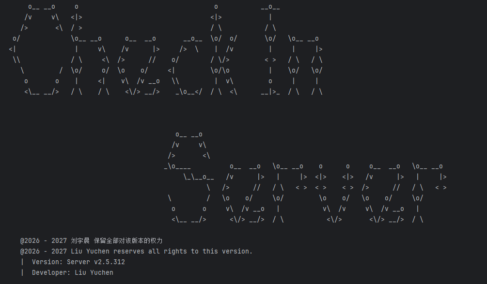
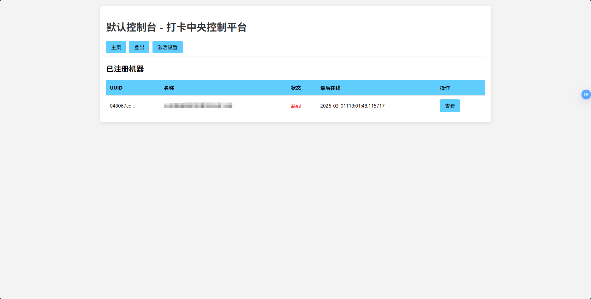

# 适用于Windows的多人打卡程序v2.5.358


<!-- PROJECT LOGO -->
<br />

<p align="center">
  <a href="https://github.com/liuyuchen012/daikai">
    
  </a>

  <h3 align="center">多人打卡系统</h3>
  <p align="center">
    使你更好地管理学生
    <br />
    <a href="https://github.com/liuyuchen012/daikai"><strong>探索本项目的文档 »</strong></a>
    <br />
    <br />
    <a href="https://github.com/liuyuchen012/daikai/">查看Demo</a>
    ·
    <a href="https://github.com/liuyuchen012/daikai/issues">报告Bug</a>
    ·
    <a href="https://github.com/liuyuchen012/daikai/issues">提出新特性</a>
  </p>
</p>

## 屏幕截图


## 作者

**刘宇晨** - liuyuchen012 - [GitHub](https://github.com/liuyuchen012)

一名生活在天津的初中生

## 项目介绍

本人在班级担任电子教学管理员的职位，受数学老师使用Deepseek制作的打卡程序启发，制作了本程序。

## 程序介绍 


v2.5.312 在线版是本项目的首个支持网络联机的版本，提供以下功能：

- **多模式支持（main.py)**：
  - 客户端模式：连接到远程服务器进行打卡
  - 服务器模式：作为中央服务器，支持多客户端连接
  - 本地模式：离线使用，数据保存在本地

- **自定义界面 (show_ui.py)**：
  - 无边框窗口设计，现代化UI
  - 自定义标题栏，支持窗口拖拽
  - 集成菜单栏到标题栏

- **数据管理（main.py)**：
  - 导出/导入打卡数据
  - 从服务器加载/同步数据
  - 清空打卡记录

- **实时状态（main.py)**：
  - 服务器状态监控
  - 在线状态显示

v2.5.358 修复2.5.312的exit Bug

- 修复了已知问题

## 如何使用

### 1. 环境要求

- Python 3.11+
- 对于客户端 （main.py)： Windows 操作系统 
- 对于服务端中心服务器（centl_server.py): Windows 操作系统 / Linux 操作系统

### 2. 安装依赖

```bash
pip install requests cryptography
```

### 3. 配置

使用 `config.ini` 配置文件配置班级信息：

```ini
[config]
nj = 7              ; 年级
class_id = 1        ; 班级
z = 7               ; 排版横行
l = 7               ; 排版竖行
km = 数学           ; 科目
school = XX中学     ; 学校
online = 0          ; 在线模式开关：0关闭，1开启
bd_online = 0       ; 服务器模式开关：0关闭，1开启
online_ip = 192.168.1.100  ; 服务器IP
server_port = 5000  ; 服务器端口
server_password =   ; 服务器密码
admin_password =    ; 管理员密码
```

### 4. 添加学生信息

在 `name.txt` 中添加学生信息，每行一个学生：

```txt
张三
李四
王五
```

### 5. 运行程序

```bash
python online.py
```

或运行已编译的可执行文件。

## 使用模式

### 客户端模式

1. 设置 `online = 1`
2. 设置 `bd_online = 0`
3. 填写服务器IP和端口
4. 启动程序即可连接服务器

### 服务器模式

1. 设置 `bd_online = 1`
2. 填写本机IP和端口
3. 设置服务器密码
4. 启动程序将自动启动服务器

### 本地模式

1. 设置 `online = 0`
2. 启动程序即可离线使用

## 窗口操作

- **拖拽窗口**：按住标题栏任意位置拖动
- **最大化/还原**：点击标题栏右侧的□按钮
- **最小化**：点击标题栏右侧的-按钮
- **关闭**：点击标题栏右侧的✕按钮

## 菜单功能

- **文件**：
  - 导出打卡数据
  - 导入打卡数据
  - 清空打卡记录
  - 退出

- **远程**：
  - 远程服务器设置
  - 检查服务器状态
  - 从服务器加载数据
  - 同步数据到服务器

- **设置**：
  - 管理员设置

- **帮助**：
  - Github
  - 检查版本列表
  - 关于

## 常见错误

### 错误1：除零错误

**错误信息**：
```
ZeroDivisionError: division by zero
```

**解决办法**：
删除了 `name.txt` 中的内容但保留了文件。向文件中添加学生信息或删除该文件即可解决。

### 错误2：配置文件错误

**错误信息**：
```
KeyError: 'config'
```

**解决办法**：
`config.ini` 文件缺失或格式错误。确保文件存在且包含 `[config]` 节。

### 错误3：网络连接失败

**错误信息**：
```
连接超时 / 无法连接到服务器
```

**解决办法**：
1. 检查服务器IP和端口是否正确
2. 确认服务器已启动且处于在线状态
3. 检查网络连接和防火墙设置

## 许可证

版权所有 (c) 2025 - Now 刘宇晨

## 更多

如发现更多 BUG，请向我们[报告](https://github.com/liuyuchen012/daikai/issues)，我们会尽力解决。


# 适用于Windows的多人打卡程序v2.5.312 -服务端


<!-- PROJECT LOGO -->
<br />

<p align="center">
  <a href="https://github.com/liuyuchen012/daikai">
    
  </a>

  <h3 align="center">多人打卡系统</h3>
  <p align="center">
    使你更好地管理学生
    <br />
    <a href="https://github.com/liuyuchen012/daikai"><strong>探索本项目的文档 »</strong></a>
    <br />
    <br />
    <a href="https://github.com/liuyuchen012/daikai/">查看Demo</a>
    ·
    <a href="https://github.com/liuyuchen012/daikai/issues">报告Bug</a>
    ·
    <a href="https://github.com/liuyuchen012/daikai/issues">提出新特性</a>
  </p>
</p>

## 作者

**刘宇晨** - liuyuchen012 - [GitHub](https://github.com/liuyuchen012)

一名生活在天津的初中生

## 屏幕截图


## 项目介绍

本人在班级担任电子教学管理员的职位，受数学老师使用Deepseek制作的打卡程序启发，制作了本程序。

## 程序介绍 


### v2.5.312 是本程序首个客户端和服务端的分体式版本：

- 本介绍适用于服务器版本


## 如何使用

### 1. 环境要求

- Python 3.11+
- 对于客户端 （main.py)： Windows 操作系统 
- 对于服务端中心服务器（centl_server.py): Windows 操作系统 / Linux 操作系统

### 2. 安装依赖


Flask>=3.0.0
cryptography>=41.0.0
```shell
pip install flask cryptography
```

### 3. 配置

使用 `server_config.ini` 配置文件配置班级信息：


> server_config.ini
> ```ini
> [Server]
> host = 0.0.0.0   # ip地址
> port = 8393      # 端口
> debug = False    # flask调试模式开关
> server_name = 默认控制台     # 控制台名称
> admin_password = admin123   # 管理员密码
> ```


## 启动
### Windows for python file
```powershell
python centl_server.py
```
### Windows for exe file
```powershell
python centl_server.exe
```
### Linux for python file
```shell
python3 centl_server.py
```
### Windows for Binary file
```shell
chmod +x centl_server
./centl_server
```


## 许可证

版权所有 (c) 2025 - Now 刘宇晨

## 更多

如发现更多 BUG，请向我们[报告](https://github.com/liuyuchen012/daikai/issues)，我们会尽力解决。

