# 适用于Windows的多人打卡程序v2.5.358


<!-- PROJECT LOGO -->
<br />

<p align="center">
  <a href="https://github.com/liuyuchen012/check-in">
    
  </a>

  <h3 align="center">多人打卡系统</h3>
  <p align="center">
    使你更好地管理学生
    <br />
    <a href="https://github.com/liuyuchen012/check-in"><strong>探索本项目的文档 »</strong></a>
    <br />
    <br />
    <a href="https://github.com/liuyuchen012/check-in/">查看Demo</a>
    ·
    <a href="https://github.com/liuyuchen012/check-in/issues">报告Bug</a>
    ·
    <a href="https://github.com/liuyuchen012/check-in/issues">提出新特性</a>
  </p>
</p>


## 屏幕截图
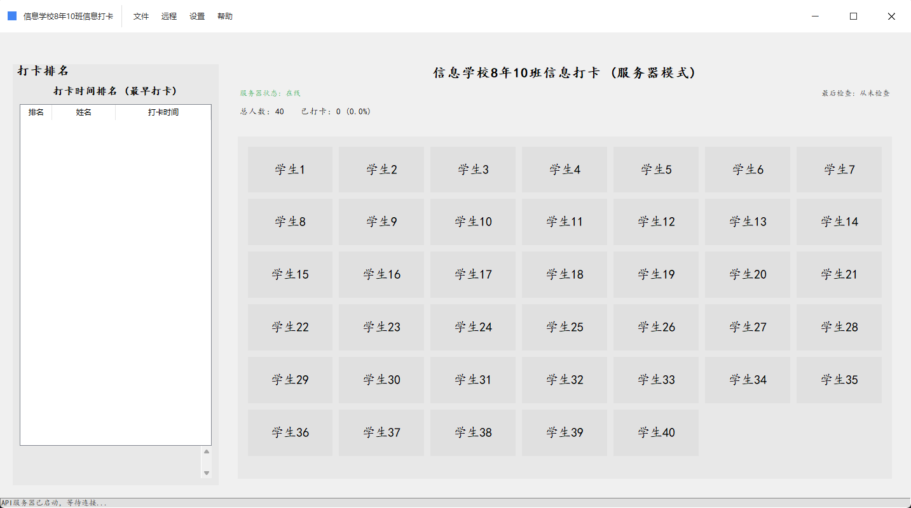

## 程序工作流程图
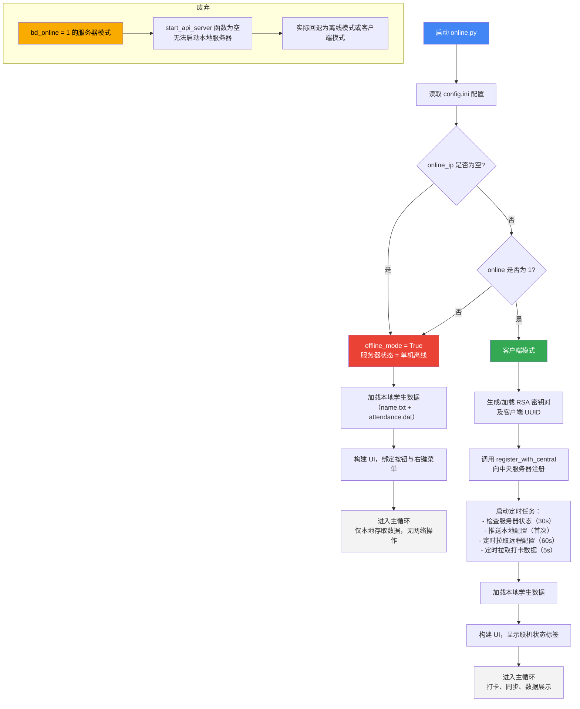
```mermaid
flowchart TD
    A[启动 online.py] --> B[读取 config.ini 配置]
    B --> C{online_ip 是否为空?}
    
    C -- 是 --> D[offline_mode = True\n服务器状态 = 单机离线]
    C -- 否 --> E{online 是否为 1?}
    
    E -- 否 --> D
    E -- 是 --> F[客户端模式]
    
    D --> G[加载本地学生数据\n（name.txt + attendance.dat）]
    G --> H[构建 UI，绑定按钮与右键菜单]
    H --> I[进入主循环\n仅本地存取数据，无网络操作]
    
    F --> J[生成/加载 RSA 密钥对\n及客户端 UUID]
    J --> K[调用 register_with_central\n向中央服务器注册]
    K --> L[启动定时任务：\n- 检查服务器状态（30s）\n- 推送本地配置（首次）\n- 定时拉取远程配置（60s）\n- 定时拉取打卡数据（5s）]
    L --> M[加载本地学生数据]
    M --> N[构建 UI，显示联机状态标签]
    N --> O[进入主循环\n打卡、同步、数据展示]
    
    subgraph 废弃
        P[bd_online = 1 的服务器模式] --> Q[start_api_server 函数为空\n无法启动本地服务器]
        Q --> R[实际回退为离线模式或客户端模式]
    end
    
    style A fill:#4285f4,color:white
    style D fill:#ea4335,color:white
    style F fill:#34a853,color:white
    style P fill:#f9ab00,color:black
    style I fill:#f3f3f3
    style O fill:#f3f3f3
```
## 作者

**刘宇晨** - liuyuchen012 - [GitHub](https://github.com/liuyuchen012)

一名生活在天津的初中生

## 项目介绍

本人在班级担任电子教学管理员的职位，受数学老师使用Deepseek制作的打卡程序启发，制作了本程序。

## 程序介绍 
v2.5.312 在线版是本项目的首个支持网络联机的版本，提供以下功能：

- **多模式支持（main.py)**：
  - 客户端模式：连接到远程服务器进行打卡
  - 服务器模式：作为中央服务器，支持多客户端连接
  - 本地模式：离线使用，数据保存在本地

- **自定义界面 (show_ui.py)**（已经嵌入exe可执行文件）：
  - 无边框窗口设计，现代化UI
  - 自定义标题栏，支持窗口拖拽
  - 集成菜单栏到标题栏

- **数据管理（main.py)**：
  - 导出/导入打卡数据
  - 从服务器加载/同步数据
  - 清空打卡记录

- **实时状态（main.py)**：
  - 服务器状态监控
  - 在线状态显示

v2.5.358 修复2.5.312的exit Bug

- 修复了已知问题
## 分区介绍
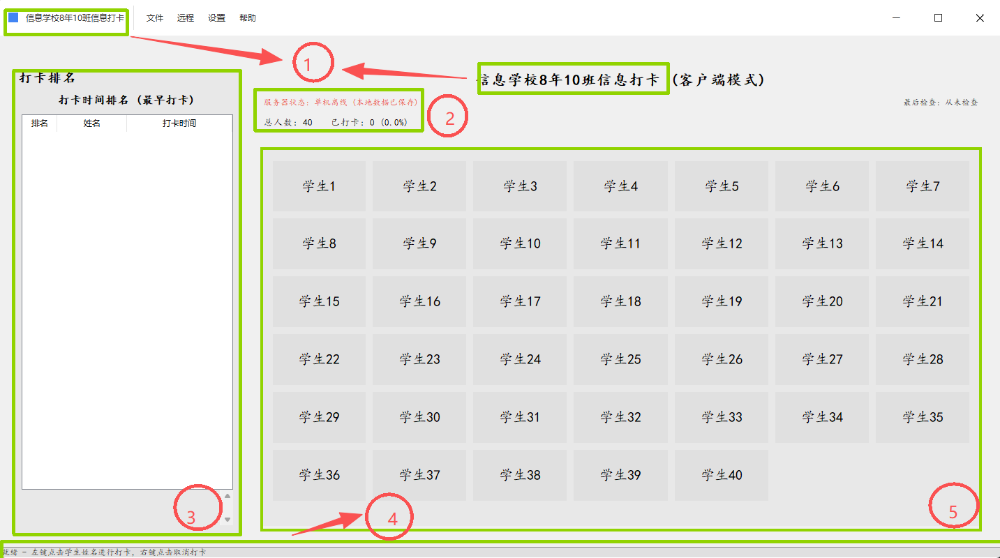

### 1 - 班级信息显示区
通过设置->管理员设置->系统设置 进行修改

### 2 - 打卡模式及数据显示区
打卡模式选择请阅读后续文档 如何使用-使用模式
打卡百分比由软件自动计算，公式为:punched / total * 100

### 3 - 排名显示区
排名按时间计算
前三名会按如下图所示`分色`显示：<br>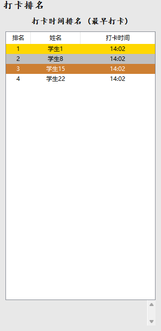

### 4 - 信息提示边条
根据操作进行提示

### 5- 打卡区
通过点击姓名完成打卡


## 如何使用

### 1. 环境要求

- Python 3.11+
- 对于客户端 <br>（main.py）： Windows 10及以上操作系统 + show_ui.py<br>
             (exe可执行文件)：Windows 10及以上操作系统
- 对于服务端中心服务器<br>（centl_server.py): Windows 操作系统 / Linux 操作系统 + Python11-14
<br>(可执行文件): Windows Server2016及以上,Windows 7及以上，Ubuntu，deepin


### 2. 安装依赖(可执行文件除外)

shell:
```shell
pip install requests cryptography
```

### 3. 配置

使用 `config.ini` 配置文件配置班级信息：

```ini
[config]
nj = 7              ; 年级
class_id = 1        ; 班级
z = 7               ; 排版横行
l = 7               ; 排版竖行
km = 数学           ; 科目
school = XX中学     ; 学校
online = 0          ; 在线模式开关：0关闭，1开启
bd_online = 0       ; 服务器模式开关：0关闭，1开启
online_ip = 192.168.1.100  ; 服务器IP
server_port = 5000  ; 服务器端口
server_password =   ; 服务器密码
admin_password =    ; 管理员密码
```
于此同时您也可以在GUI中进行配置
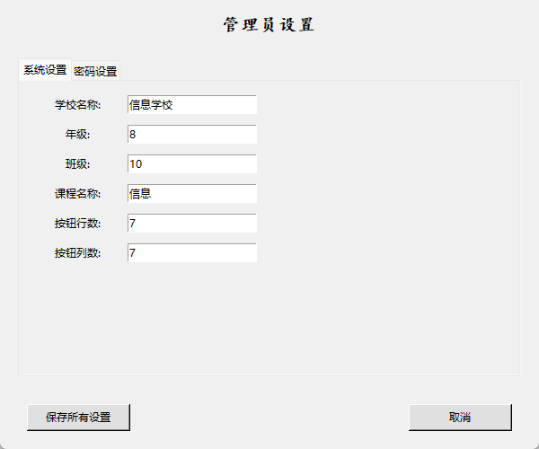

### 4. 添加学生信息

在 `name.txt` 中添加学生信息，每行一个学生：

```txt
张三
李四
王五
```

### 5. 运行程序

```shell
python online.py
```

或运行已编译的可执行文件(exe)。

### 6 如何连接远程服务器

#### 6.0 远程服务器链接时，客户端工作流程图：
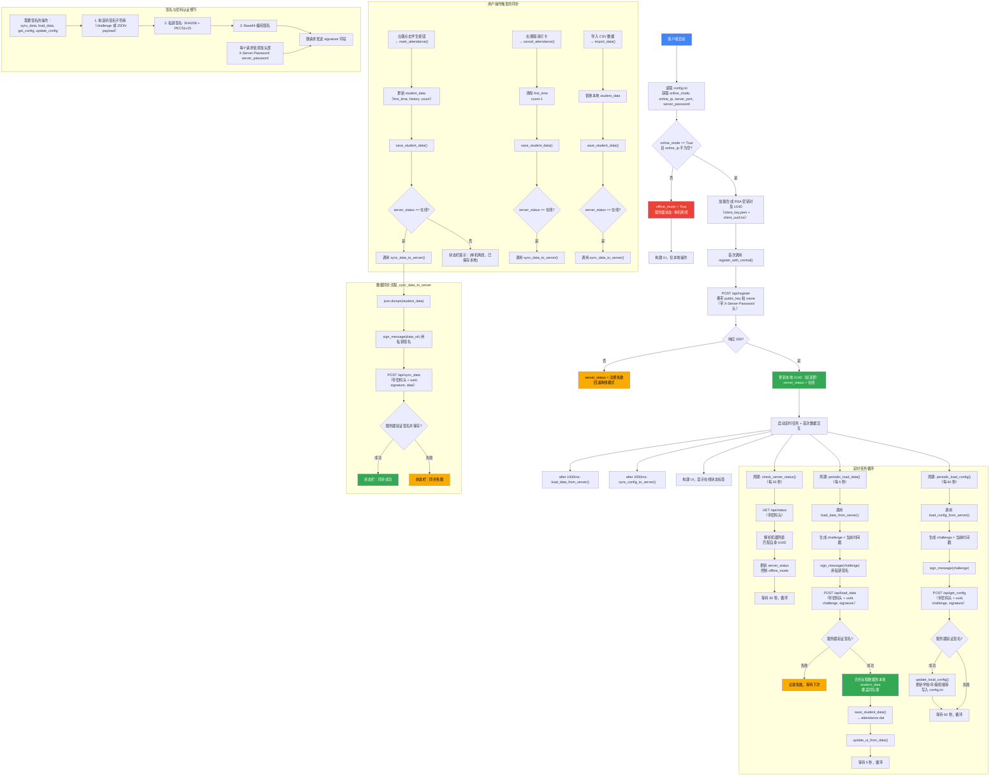
```mermaid
flowchart TD
    Start["客户端启动"] --> LoadConfig["读取 config.ini<br>获取 online_mode, online_ip, server_port, server_password"]
    LoadConfig --> CheckOnline{online_mode == True<br>且 online_ip 不为空?}

    CheckOnline -- 否 --> OfflineMode["offline_mode = True<br>服务器状态: 单机离线"]
    CheckOnline -- 是 --> KeyGen["加载/生成 RSA 密钥对<br>及 UUID<br>（client_key.pem + client_uuid.txt）"]

    OfflineMode --> UISetup["构建 UI，仅本地操作"]

    KeyGen --> InitRegister["首次调用 register_with_central()"]
    InitRegister --> RegFlow["POST /api/register<br>携带 public_key 和 name<br>（带 X-Server-Password 头）"]

    RegFlow --> RegCheck{响应 200?}
    RegCheck -- 是 --> UpdateUUID["更新本地 UUID（如变更）<br>server_status = 在线"]
    RegCheck -- 否 --> RegFail["server_status = 注册失败<br>回退离线模式"]

    UpdateUUID --> InitTasks["启动定时任务 + 首次数据交互"]
    InitTasks --> FirstLoad["after 1000ms: load_data_from_server()"]
    InitTasks --> FirstConfigPush["after 2000ms: sync_config_to_server()"]
    InitTasks --> PeriodicLoadData["周期: periodic_load_data()<br>（每 5 秒）"]
    InitTasks --> PeriodicLoadConfig["周期: periodic_load_config()<br>（每 60 秒）"]
    InitTasks --> PeriodicStatus["周期: check_server_status()<br>（每 30 秒）"]
    InitTasks --> UIOnline["构建 UI，显示在线状态标签"]

    subgraph 定时任务循环
        PeriodicStatus --> StatusFlow["GET /api/status<br>（带密码头）"]
        StatusFlow --> ParseStatus["解析机器列表<br>匹配自身 UUID"]
        ParseStatus --> UpdateStatus["更新 server_status<br>控制 offline_mode"]
        UpdateStatus --> WaitStatus["等待 30 秒，循环"]

        PeriodicLoadData --> LoadDataFlow["调用 load_data_from_server()"]

        LoadDataFlow --> GenChallenge1["生成 challenge = 当前时间戳"]
        GenChallenge1 --> SignChallenge1["sign_message(challenge)<br>用私钥签名"]
        SignChallenge1 --> PostLoad["POST /api/load_data<br>（带密码头 + uuid, challenge, signature）"]

        PostLoad --> LoadVerify{"服务器验证签名?"}
        LoadVerify -- 失败 --> LoadFail["记录失败，等待下次"]
        LoadVerify -- 成功 --> MergeData["合并远程数据到本地 student_data<br>覆盖同名键"]
        MergeData --> SaveLocal["save_student_data()<br>→ attendance.dat"]
        SaveLocal --> UpdateUILoad["update_ui_from_data()"]
        UpdateUILoad --> WaitLoad["等待 5 秒，循环"]

        PeriodicLoadConfig --> LoadConfigFlow["调用 load_config_from_server()"]
        LoadConfigFlow --> GenChallenge2["生成 challenge = 当前时间戳"]
        GenChallenge2 --> SignChallenge2["sign_message(challenge)"]
        SignChallenge2 --> PostGetConfig["POST /api/get_config<br>（带密码头 + uuid, challenge, signature）"]
        PostGetConfig --> ConfigVerify{"服务器验证签名?"}
        ConfigVerify -- 成功 --> UpdateLocal["update_local_config()<br>更新学校/年级/班级等<br>写入 config.ini"]
        UpdateLocal --> WaitConfig["等待 60 秒，循环"]
        ConfigVerify -- 失败 --> WaitConfig
    end

    subgraph 用户操作触发的同步
        UserPunch["左键点击学生按钮<br>→ mark_attendance()"] --> UpdateLocalData["更新 student_data<br>（first_time, history, count）"]
        UpdateLocalData --> SaveLocal1["save_student_data()"]
        SaveLocal1 --> CheckOnlinePunch{server_status == 在线?}
        CheckOnlinePunch -- 是 --> SyncPunch["调用 sync_data_to_server()"]
        CheckOnlinePunch -- 否 --> StatusMsg["状态栏提示：[单机离线，已保存本地]"]

        UserCancel["右键取消打卡<br>→ cancel_attendance()"] --> UpdateCancel["清除 first_time<br>count-1"]
        UpdateCancel --> SaveLocal2["save_student_data()"]
        SaveLocal2 --> CheckOnlineCancel{server_status == 在线?}
        CheckOnlineCancel -- 是 --> SyncCancel["调用 sync_data_to_server()"]

        UserImport["导入 CSV 数据<br>→ import_data()"] --> ReplaceData["替换本地 student_data"]
        ReplaceData --> SaveLocal3["save_student_data()"]
        SaveLocal3 --> CheckOnlineImport{server_status == 在线?}
        CheckOnlineImport -- 是 --> SyncImport["调用 sync_data_to_server()"]
    end

    subgraph 数据同步流程_sync_data_to_server
        SyncPunch --> Serialize["json.dumps(student_data)"]
        Serialize --> SignData["sign_message(data_str) 用私钥签名"]
        SignData --> PostSync["POST /api/sync_data<br>（带密码头 + uuid, signature, data）"]
        PostSync --> SyncVerify{"服务器验证签名并保存?"}
        SyncVerify -- 成功 --> SyncOK["状态栏：同步成功"]
        SyncVerify -- 失败 --> SyncFail["状态栏：同步失败"]
    end

    subgraph 签名与密码认证细节
        AuthHeader["每个请求皆添加头部<br>X-Server-Password: server_password"]
        SignStep["需要签名的操作：<br>sync_data, load_data, get_config, update_config"]
        SignStep --> SignProcess["1. 构造待签名字符串<br>（challenge 或 JSON payload）"]
        SignProcess --> SignHash["2. 私钥签名: SHA256 + PKCS1v15"]
        SignHash --> SignB64["3. Base64 编码签名"]
        SignB64 --> SendRequest["随请求发送 signature 字段"]
        AuthHeader --> SendRequest
    end

    style Start fill:#4285f4,color:white
    style OfflineMode fill:#ea4335,color:white
    style UpdateUUID fill:#34a853,color:white
    style MergeData fill:#34a853,color:white
    style SyncOK fill:#34a853,color:white
    style RegFail fill:#f9ab00,color:black
    style LoadFail fill:#f9ab00,color:black
    style SyncFail fill:#f9ab00,color:black
```


#### 6.1 设置服务器地址（IPv4地址/域名),端口（默认8393），服务器密码
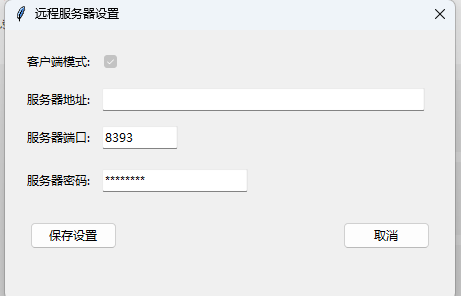
>如何获取这些？<br>
> 6.1.2 确保已部署了了服务端，如未进行部署请下滑至服务端文档区域<br>
> 6.1.3 运行服务器程序即可在如下图所示区域找到ip地址及端口，如果您将其开放至公网请将ip地址替换为公网ip。
> 6.1.4 服务器密码为如下图所示的管理员密码
> 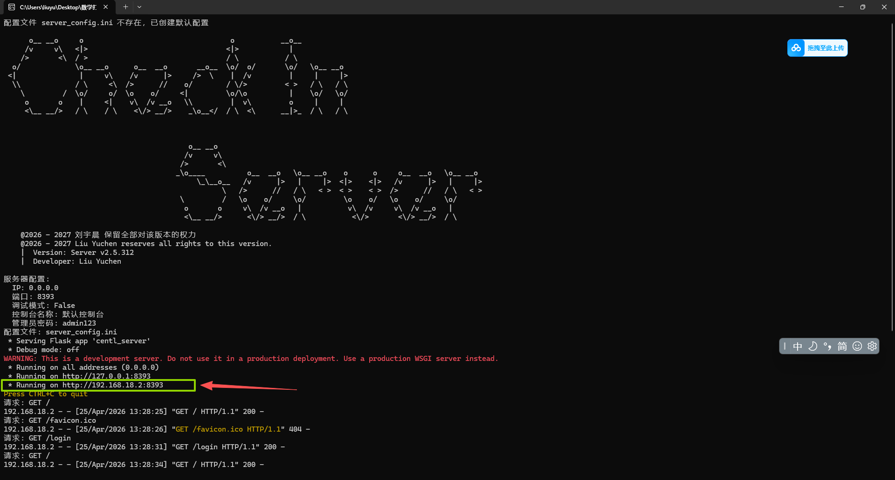

#### 6.2 点击保存，并重启程序
## 使用模式

>V2.5.358 彻底删除了服务器模式，仅保留客户端模式和本地模式；
### 客户端模式
1. 在GUI中远程-> 远程服务器设置
2. 填写服务器IP，端口，服务器密码
3. 启动保存,重启后即可连接服务器


### ~~服务器模式(废弃）~~  

1. 设置 `bd_online = 1`
2. 填写本机IP和端口
3. 设置服务器密码
4. 启动程序将自动启动服务器

### 本地模式

1. 当服务器地址为空时默认为本地模式

## 菜单功能

- **文件**：
  - 导出打卡数据
  - 导入打卡数据
  - 清空打卡记录
  - 退出

- **远程**：
  - 远程服务器设置
  - 检查服务器状态
  - 从服务器加载数据
  - 同步数据到服务器

- **设置**：
  - 管理员设置

- **帮助**：
  - Github
  - 检查版本列表
  - 关于

## 常见错误

### 错误1：除零错误

**错误信息**：
```
ZeroDivisionError: division by zero
```

**解决办法**：
删除了 `name.txt` 中的内容但保留了文件。向文件中添加学生信息或删除该文件即可解决。

### 错误2：配置文件错误

**错误信息**：
```
KeyError: 'config'
```

**解决办法**：
`config.ini` 文件缺失或格式错误。确保文件存在且包含 `[config]` 节。

### 错误3：网络连接失败

**错误信息**：
```
连接超时 / 无法连接到服务器
```

**解决办法**：
1. 检查服务器IP和端口是否正确
2. 确认服务器已启动且处于在线状态
3. 检查网络连接和防火墙设置

## 开源许可证
GNU GPL v3

刘宇晨授权你，修改，复制，发行新版本
online.py v2.5.358版权所有 (c) 2025 - Now 刘宇晨

## 更多

如发现更多 BUG，请向我们[报告](https://github.com/liuyuchen012/daikai/issues)，我们会尽力解决。
<br>
<br>
<br>
<br>
<br>
<br>
<br>
<br>
<br>
<br>
<br>
<br>
<br>
<br>
<br>
<br>
<br>
<br>
<br>
<br>
<br>
<br>
<br>
<br>
<br>
<br>
<br>
<br>
<br>
<br>
<br>
<br>
<br>
<br>
<br>
<br>

# 适用于Windows的多人打卡程序v2.5.312 -服务端


<!-- PROJECT LOGO -->
<br />

<p align="center">
  <a href="https://github.com/liuyuchen012/daikai">
    
  </a>

  <h3 align="center">多人打卡系统</h3>
  <p align="center">
    使你更好地管理学生
    <br />
    <a href="https://github.com/liuyuchen012/daikai"><strong>探索本项目的文档 »</strong></a>
    <br />
    <br />
    <a href="https://github.com/liuyuchen012/daikai/">查看Demo</a>
    ·
    <a href="https://github.com/liuyuchen012/daikai/issues">报告Bug</a>
    ·
    <a href="https://github.com/liuyuchen012/daikai/issues">提出新特性</a>
  </p>
</p>

## 作者

**刘宇晨** - liuyuchen012 - [GitHub](https://github.com/liuyuchen012)

一名生活在天津的初中生

## 屏幕截图
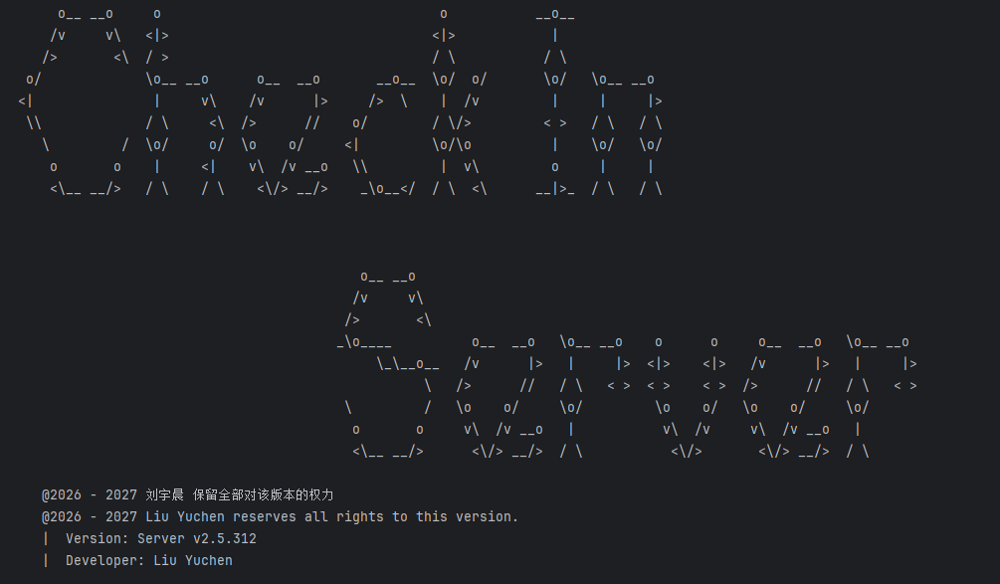
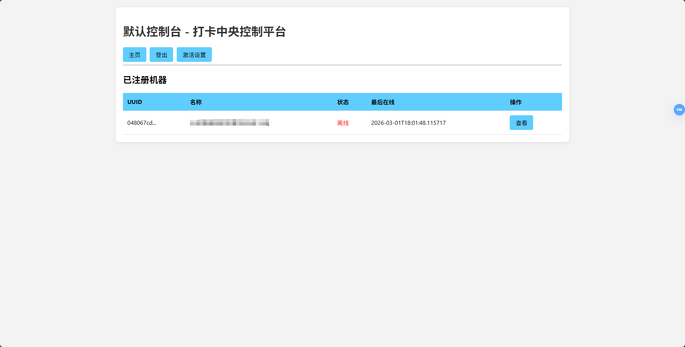
## 项目介绍

本人在班级担任电子教学管理员的职位，受数学老师使用Deepseek制作的打卡程序启发，制作了本程序。

## 程序介绍 

### 业务逻辑图
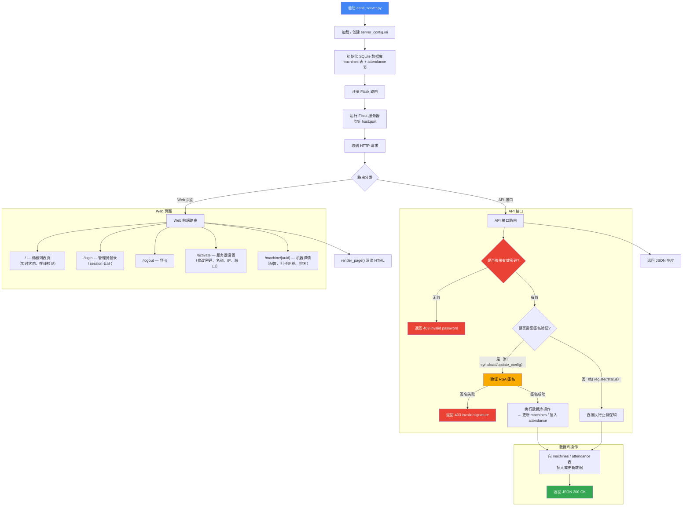
```mermaid
flowchart TD
    Start["启动 centl_server.py"] --> LoadConfig["加载 / 创建 server_config.ini"]
    LoadConfig --> InitDB["初始化 SQLite 数据库<br>machines 表 + attendance 表"]
    InitDB --> SetupRoutes["注册 Flask 路由"]
    SetupRoutes --> RunServer["运行 Flask 服务器<br>监听 host:port"]
    
    RunServer --> ReqArrive["收到 HTTP 请求"]
    ReqArrive --> RouteType{"路由分发"}
    
    RouteType -- "Web 页面" --> WebPage["Web 前端路由"]
    RouteType -- "API 接口" --> APICall["API 接口路由"]
    
    subgraph "Web 页面"
        WebPage --> Home["/ — 机器列表页<br>（实时状态、在线检测）"]
        WebPage --> Login["/login — 管理员登录<br>（session 认证）"]
        WebPage --> Logout["/logout — 登出"]
        WebPage --> Activate["/activate — 服务器设置<br>（修改密码、名称、IP、端口）"]
        WebPage --> MachineDetail["/machine/[uuid] — 机器详情<br>（配置、打卡网格、排名）"]
    end
    
    subgraph "API 接口"
        APICall --> CheckPassword{"是否携带有效密码?"}
        CheckPassword -- "无效" --> Error403["返回 403 invalid password"]
        CheckPassword -- "有效" --> CheckSignature{"是否需要签名验证?"}
        
        CheckSignature -- "是（如 sync/load/update_config）" --> VerifySign["验证 RSA 签名"]
        VerifySign -- "签名失败" --> Error403Sign["返回 403 invalid signature"]
        VerifySign -- "签名成功" --> ExecuteAPI["执行数据库操作<br>→ 更新 machines / 插入 attendance"]
        CheckSignature -- "否（如 register/status）" --> DirectExec["直接执行业务逻辑"]
    end
    
    subgraph "数据库操作"
        ExecuteAPI --> DBWrite["向 machines / attendance 表<br>插入或更新数据"]
        DirectExec --> DBWrite
        DBWrite --> SuccessResp["返回 JSON 200 OK"]
    end
    
    WebPage --> RenderTemplate["render_page() 渲染 HTML"]
    APICall --> ReturnJSON["返回 JSON 响应"]
    
    style Start fill:#4285f4,color:white
    style CheckPassword fill:#ea4335,color:white
    style VerifySign fill:#f9ab00,color:black
    style SuccessResp fill:#34a853,color:white
    style Error403 fill:#ea4335,color:white
    style Error403Sign fill:#ea4335,color:white

```

### v2.5.312 是本程序首个客户端和服务端的分体式版本：

- 本介绍适用于服务器版本


## 如何使用

### 1. 环境要求

- Python 3.11+
- 对于客户端 （main.py)： Windows 操作系统 
- 对于服务端中心服务器（centl_server.py): Windows 操作系统 / Linux 操作系统

### 2. 安装依赖


Flask>=3.0.0
cryptography>=41.0.0
```shell
pip install flask cryptography
```

### 3. 配置

使用 `server_config.ini` 配置文件配置信息：


> server_config.ini
> ```ini
> [Server]
> host = 0.0.0.0   # ip地址
> port = 8393      # 端口
> debug = False    # flask调试模式开关
> server_name = 默认控制台     # 控制台名称
> admin_password = admin123   # 管理员密码
> ```


## 启动
### Windows for python file
```powershell
python centl_server.py
```
### Windows for exe file
```shell
centl_server
```
### Linux for python file
```shell
python3 centl_server.py
```
### Linux for Binary file
```shell
chmod +x centl_server
./centl_server
```

## Wed功能
### 设备列表
当客户端完成绑定并重启连接后，设备将在列表显示
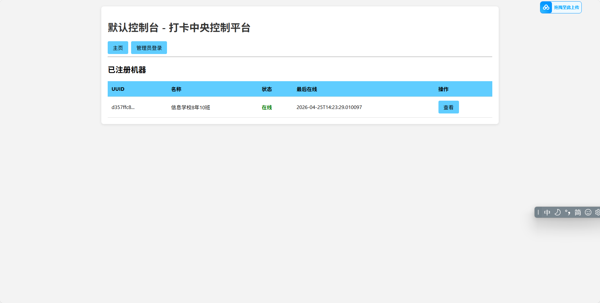
### 打卡
非管理员可在线查看打卡状态：
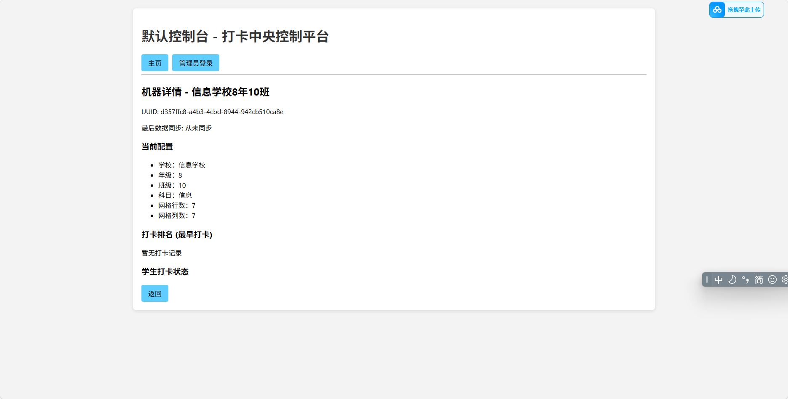
管理员登录后可修改打卡信息，及取消或添加打卡数据：
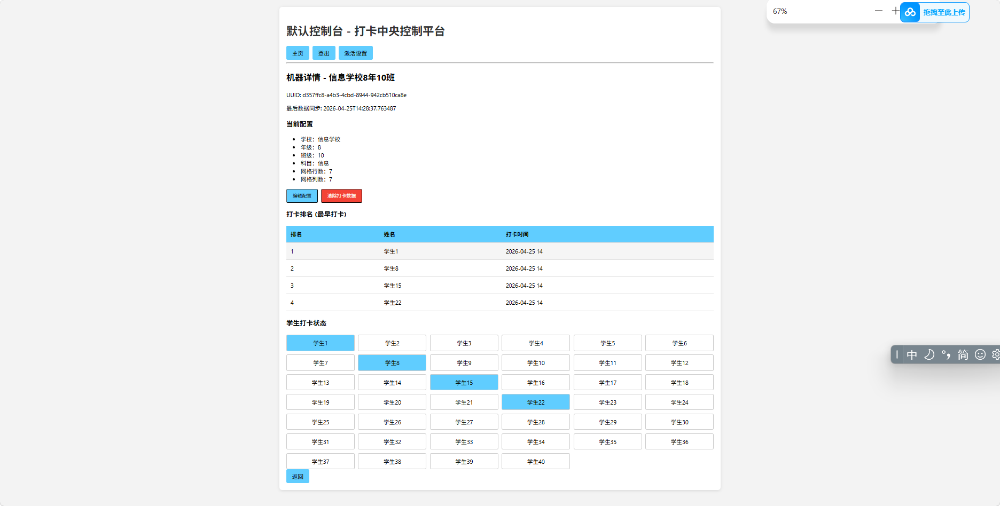

## 许可证

版权所有 (c) 2025 - Now 刘宇晨

## 更多

如发现更多 BUG，请向我们[报告](https://github.com/liuyuchen012/daikai/issues)，我们会尽力解决。

<br>
<br>
<br>
<br>
<br>
<br><br>
<br><br><br><br><br><br><br><br><br>


# 适用于Windows的多人打卡程序v2.5.358的UI依赖文件（show_ui.py)


<!-- PROJECT LOGO -->
<br />

<p align="center">
  <a href="https://github.com/liuyuchen012/daikai">
    
  </a>

  <h3 align="center">多人打卡系统</h3>
  <p align="center">
    使你更好地管理学生
    <br />
    <a href="https://github.com/liuyuchen012/daikai"><strong>探索本项目的文档 »</strong></a>
    <br />
    <br />
    <a href="https://github.com/liuyuchen012/daikai/">查看Demo</a>
    ·
    <a href="https://github.com/liuyuchen012/daikai/issues">报告Bug</a>
    ·
    <a href="https://github.com/liuyuchen012/daikai/issues">提出新特性</a>
  </p>
</p>

## 屏幕截图


## 作者

**刘宇晨** - liuyuchen012 - [GitHub](https://github.com/liuyuchen012)

一名生活在天津的初中生

## 项目介绍
show_ui.py用于渲染大屏打卡主程序的所有页面

## 程序介绍 
### 模块工作图
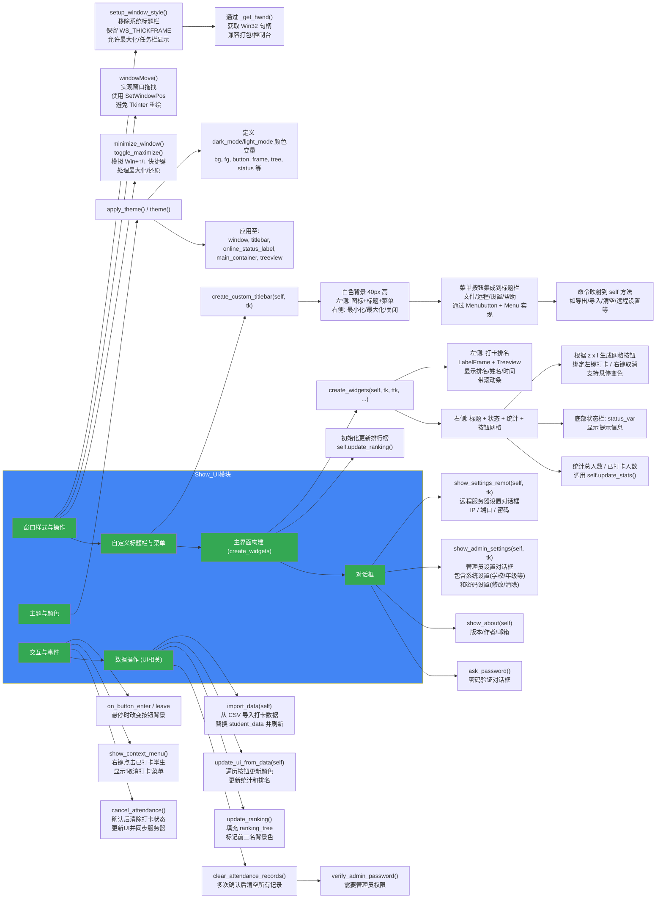
```mermaid
flowchart LR
    subgraph Show_UI模块
        WinStyle["窗口样式与操作"]
        TitleBar["自定义标题栏与菜单"]
        Theme["主题与颜色"]
        MainUI["主界面构建 (create_widgets)"]
        Dialogs["对话框"]
        Events["交互与事件"]
        DataOps["数据操作 (UI相关)"]
    end

    WinStyle --> SetupStyle["setup_window_style()<br>移除系统标题栏<br>保留 WS_THICKFRAME<br>允许最大化/任务栏显示"]
    SetupStyle --> HWND["通过 _get_hwnd()<br>获取 Win32 句柄<br>兼容打包/控制台"]
    WinStyle --> Drag["windowMove()<br>实现窗口拖拽<br>使用 SetWindowPos<br>避免 Tkinter 重绘"]
    WinStyle --> MaxMin["minimize_window()<br>toggle_maximize()<br>模拟 Win+↑/↓ 快捷键<br>处理最大化/还原"]

    TitleBar --> CreateBar["create_custom_titlebar(self, tk)"]
    CreateBar --> BarLayout["白色背景 40px 高<br>左侧: 图标+标题+菜单<br>右侧: 最小化/最大化/关闭"]
    BarLayout --> Menu["菜单按钮集成到标题栏<br>文件/远程/设置/帮助<br>通过 Menubutton + Menu 实现"]
    Menu --> Commands["命令映射到 self 方法<br>如导出/导入/清空/远程设置等"]

    Theme --> ApplyTheme["apply_theme() / theme()"]
    ApplyTheme --> ColorVars["定义 dark_mode/light_mode 颜色变量<br>bg, fg, button, frame, tree, status 等"]
    ApplyTheme --> ApplyTo["应用至:<br>window, titlebar, <br>online_status_label, <br>main_container, treeview"]

    MainUI --> CreateWidgets["create_widgets(self, tk, ttk, ...)"]
    CreateWidgets --> LeftPanel["左侧: 打卡排名<br>LabelFrame + Treeview<br>显示排名/姓名/时间<br>带滚动条"]
    CreateWidgets --> RightPanel["右侧: 标题 + 状态 + 统计 + 按钮网格"]
    RightPanel --> Grid["根据 z x l 生成网格按钮<br>绑定左键打卡 / 右键取消<br>支持悬停变色"]
    RightPanel --> StatusBar["底部状态栏: status_var<br>显示提示信息"]
    RightPanel --> Stats["统计总人数 / 已打卡人数<br>调用 self.update_stats()"]
    MainUI --> InitRanking["初始化更新排行榜<br>self.update_ranking()"]

    Dialogs --> RemoteSettings["show_settings_remot(self, tk)<br>远程服务器设置对话框<br>IP / 端口 / 密码"]
    Dialogs --> AdminSettings["show_admin_settings(self, tk)<br>管理员设置对话框<br>包含系统设置(学校/年级等)<br>和密码设置(修改/清除)"]
    Dialogs --> About["show_about(self)<br>版本/作者/邮箱"]
    Dialogs --> PasswordPrompt["ask_password()<br>密码验证对话框"]

    Events --> Hover["on_button_enter / leave<br>悬停时改变按钮背景"]
    Events --> ContextMenu["show_context_menu()<br>右键点击已打卡学生<br>显示'取消打卡'菜单"]
    Events --> Cancel["cancel_attendance()<br>确认后清除打卡状态<br>更新UI并同步服务器"]

    DataOps --> Import["import_data(self)<br>从 CSV 导入打卡数据<br>替换 student_data 并刷新"]
    DataOps --> UpdateUI["update_ui_from_data(self)<br>遍历按钮更新颜色<br>更新统计和排名"]
    DataOps --> UpdateRanking["update_ranking()<br>填充 ranking_tree<br>标记前三名背景色"]

    DataOps --> Clear["clear_attendance_records()<br>多次确认后清空所有记录"]
    Clear --> VerifyAdmin["verify_admin_password()<br>需要管理员权限"]

    WinStyle --> TitleBar --> MainUI --> Dialogs
    Events --> DataOps

    style Show_UI模块 fill:#4285f4,color:white
    style WinStyle fill:#34a853,color:white
    style TitleBar fill:#34a853,color:white
    style Theme fill:#34a853,color:white
    style MainUI fill:#34a853,color:white
    style Dialogs fill:#34a853,color:white
    style Events fill:#34a853,color:white
    style DataOps fill:#34a853,color:white
```

v2.5.358:首个分体式ui函数文件的修复
- 修复已知问题

## 如何使用

### 1. 环境要求

- Python 3.11+
- 已下载Windows大屏打卡-客户端(online.py)
>单独下载本程序无法使用

### 2. 运行程序

将该文件与Windows大屏打卡-客户端(online.py)放置于同一目录

Windows大屏打卡-客户端(online.py)将自动运行本程序并使用

# 本程序渲染了主程序（客户端）以下内容/窗口：
## 窗口操作

- **拖拽窗口**：按住标题栏任意位置拖动
- **最大化/还原**：点击标题栏右侧的□按钮
- **最小化**：点击标题栏右侧的-按钮
- **关闭**：点击标题栏右侧的✕按钮

## 菜单功能

- **文件**：
  - 导出打卡数据
  - 导入打卡数据
  - 清空打卡记录
  - 退出

- **远程**：
  - 远程服务器设置
  - 检查服务器状态
  - 从服务器加载数据
  - 同步数据到服务器

- **设置**：
  - 管理员设置

- **帮助**：
  - Github
  - 检查版本列表
  - 关于


## 许可证

版权所有 (c) 2025 - Now 刘宇晨

## 更多

如发现更多 BUG，请向我们[报告](https://github.com/liuyuchen012/daikai/issues)，我们会尽力解决。
