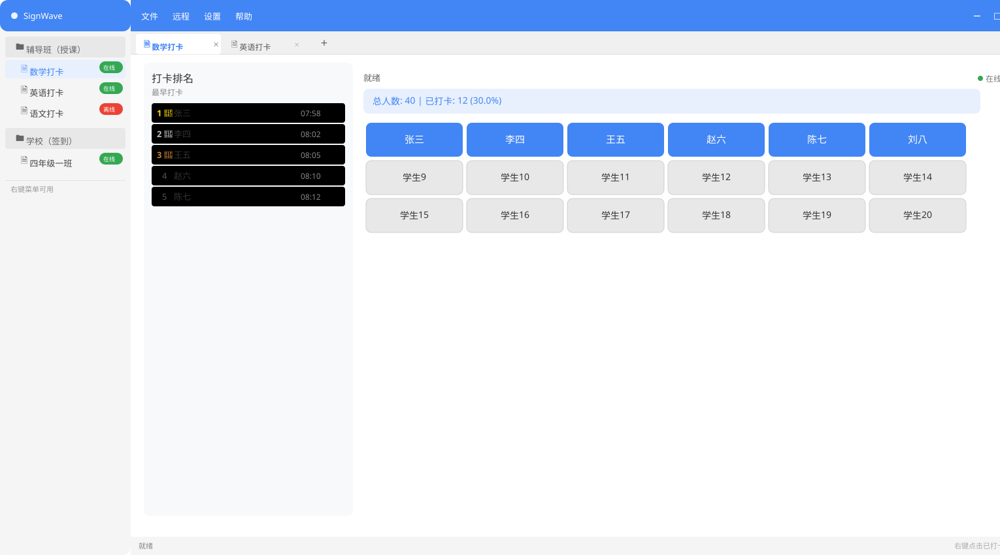

# 打卡系统 (Check-In System) V2.6

> 课堂签到打卡系统 — .NET 重制版（原 Python Tkinter + Flask）


---

## 🖼️ 界面预览



*主界面：左侧排名面板 + 右侧学生打卡网格*


---

## 📋 功能概览

| 功能 | 说明 |
|------|------|
| **学生打卡** | 点击学生姓名按钮完成签到，自动记录时间 |
| **取消打卡** | 右键已签到学生可撤销打卡 |
| **打卡排名** | 实时显示最早签到的学生排行（🥇 🥈 🥉） |
| **在线同步** | 多台电脑通过中央服务器同步数据 |
| **数据导入/导出** | CSV 格式导入导出 |
| **管理员设置** | 班级信息、按钮布局、密码保护 |
| **Web 管理端** | 浏览器访问服务器地址即可管理 |

---

## 🖥️ 跨平台支持

| 平台 | 桌面客户端 | 服务器 | 说明 |
|------|-----------|--------|------|
| **Windows** | ✅ WPF 桌面应用 | ✅ ASP.NET Core | 完整功能 |
| **Linux** | ❌ WPF 不支持 | ✅ 单文件 exe | 🌐 通过浏览器管理 |
| **macOS** | ❌ WPF 不支持 | ✅ 可交叉编译 | 🌐 通过浏览器管理 |

> 💡 **Linux 用户启动服务器后**，在浏览器打开 `http://localhost:5000` 即可完成所有打卡管理操作，无需桌面客户端。

---

## 🏗️ 项目结构

```
check-in-net/
├── CheckIn.slnx              # 解决方案
├── Shared/                   # 共享数据模型
│   └── Models/               # StudentAttendance, ClientConfig 等
├── Server/                   # ASP.NET Core Web API 服务器
│   ├── Program.cs            # Minimal API (13 个端点)
│   ├── Data/AppDbContext.cs  # EF Core + SQLite
│   └── wwwroot/template.html # Web 管理面板
└── Client/                   # WPF 桌面客户端 (仅 Windows)
    ├── MainWindow.xaml       # 现代化 GUI
    ├── ViewModels/           # MVVM 视图模型
    ├── Services/             # RSA 签名通信
    └── ModernDialog.cs       # 现代化对话框
```

---

## 🚀 快速开始

### Windows

**启动服务器：**
```bash
cd Server
CheckIn.Server.exe
# 浏览器打开 http://localhost:5000
```

**启动客户端：**
```bash
cd Client
CheckIn.Client.exe
```

### Linux

```bash
chmod +x CheckIn.Server
./CheckIn.Server --urls "http://0.0.0.0:5000"
# 浏览器打开 http://localhost:5000
```

或使用附带的启动脚本：
```bash
chmod +x start-server.sh
./start-server.sh
```

### 配置远程连接

菜单 → **远程** → **远程服务器设置**

输入服务器 IP、端口（默认 5000）和密码（默认 `admin123`）。

---

## 📖 使用说明

### 学生打卡

- **左键**点击学生姓名 → 打卡成功（按钮变蓝）
- **右键**已打卡学生 → **取消打卡**
- 排名面板实时更新，优先显示最早打卡者

### 菜单功能

| 菜单 | 功能 |
|------|------|
| **文件** | 导出/导入 CSV、清空记录、退出 |
| **远程** | 服务器设置、状态检查、数据加载/同步 |
| **设置** | 管理员设置（班级信息、布局、密码） |
| **帮助** | GitHub 链接、版本检查、关于 |

### 管理员设置

管理员设置需要密码，首次默认无密码，可在设置中配置。

可配置项：
- 学校 / 年级 / 班级 / 课程名称
- 按钮行数 / 列数
- 管理员密码

### 清空记录

管理员操作，需要验证密码，三次确认后才执行，防止误操作。

---

## 🔧 技术栈

| 组件 | 技术 |
|------|------|
| 桌面客户端 | WPF (.NET 10.0) |
| 服务器 | ASP.NET Core Minimal API |
| 数据库 | SQLite (EF Core) |
| 通信 | HTTP + RSA-2048 签名认证 |
| GUI 风格 | 原生 WPF + Windows 11 圆角 |
| 数据格式 | JSON / CSV / SQLite |

---

## 🔐 通信安全

客户端与服务器之间使用 RSA-2048 签名验证，每次数据同步都会验证数字签名，确保数据完整性和来源可信。

---

## 📦 下载

从 [GitHub Releases](https://github.com/liuyuchen012/check-in/releases) 下载最新版本：

| 安装包 | 平台 | 说明 |
|--------|------|------|
| `CheckIn-v2.6-win-x64.zip` | Windows | 客户端 + 服务器 + Web 面板 |
| `CheckIn-v2.6-linux-x64.tar.gz` | Linux | 服务器 + 启动脚本 + Web 面板 |

---

## 📄 许可协议

本项目基于 **GNU General Public License v3** 开源。

版权所有 © 2026 刘宇晨

<https://github.com/liuyuchen012/check-in>
