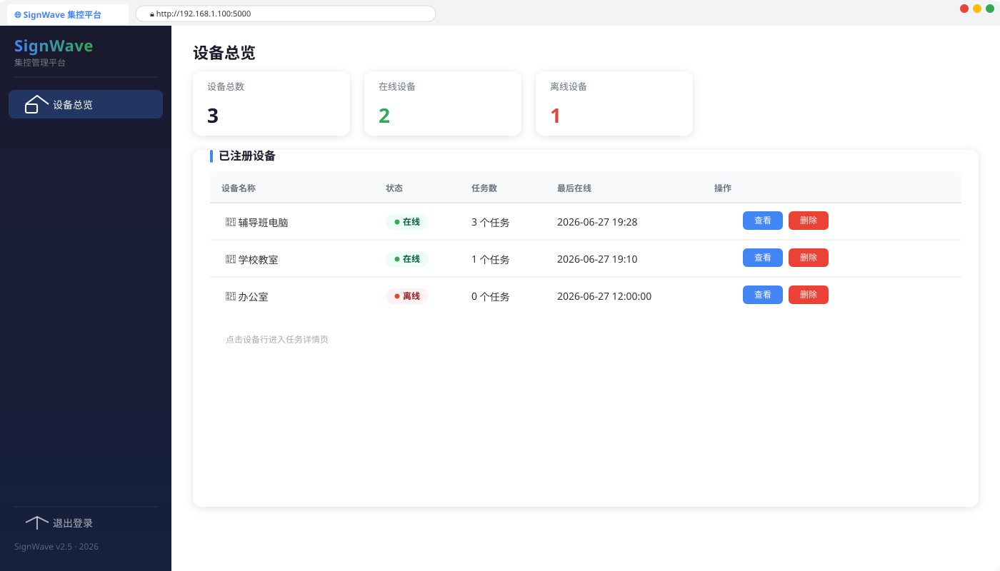
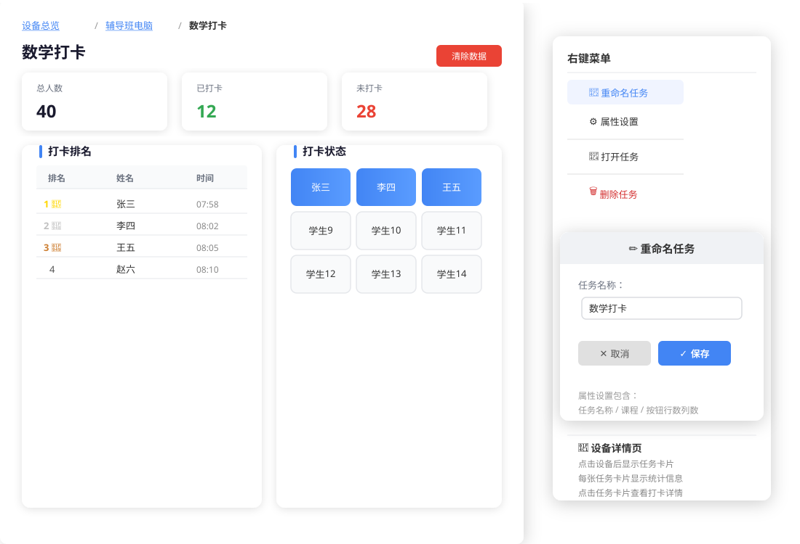

<div align="center">

# 🏫 SignWave 课堂签到打卡系统

### — 现代化桌面 + Web 双端打卡解决方案


</div>

---

## 📑 目录

- [✨ 功能概览](#-功能概览)
- [🖼️ 界面截图](#️-界面截图)
- [🏗️ 项目架构](#️-项目架构)
- [🚀 快速开始](#-快速开始)
- [📖 详细使用指南](#-详细使用指南)
- [🖥️ Web 管理面板](#️-web-管理面板)
- [🔧 多任务管理（V2.7 新功能）](#-多任务管理v27-新功能)
- [🔐 通信安全](#-通信安全)
- [🗄️ 数据存储](#️-数据存储)
- [🧰 技术栈](#-技术栈)
- [📦 编译部署](#-编译部署)
- [❓ 常见问题](#-常见问题)
- [📄 许可协议](#-许可协议)

---

## ✨ 功能概览

| 功能 | 说明 |
|------|------|
| ✅ **一键打卡** | 鼠标左键点击学生姓名，瞬间完成签到 |
| ↩ **即时取消** | 右键已签到学生，可撤销打卡 |
| 🏆 **排行榜** | 实时显示前 3 名最早打卡学生（🥇🥈🥉） |
| 📊 **数据统计** | 实时统计打卡人数、出勤率、最早/最晚打卡时间 |
| 📋 **多任务管理** | 多个打卡任务独立管理，支持标签页切换 |
| 🔄 **后台同步** | 未打开的标签页自动在后台连接服务器同步数据 |
| 🌐 **Web 管理面板** | 浏览器访问即可远程管理、查看数据 |
| 📁 **设备分组** | 服务器按设备 UUID 自动分组，一目了然 |
| 📤 **CSV 导出/导入** | Excel 兼容的 CSV 格式，随时备份恢复 |
| 🗑 **一键清空** | 管理员三次确认后安全清空所有记录 |
| 🔐 **RSA 加密通信** | 客户端与服务器之间 RSA-2048 签名验证 |
| 🖥 **跨平台服务器** | Linux/macOS 均可运行服务器，浏览器远程管理 |

---

## 🖼️ 界面截图

### 1️⃣ 主界面 — 桌面客户端

> **左侧任务树**（200px 宽，#f5f5f5 背景）→ **中间打卡排名**（320px 宽 ListView）→ **右侧学生打卡网格**（UniformGrid 6 列按钮）
>
> 顶部蓝色标题栏包含菜单按钮（文件/远程/设置/帮助）和窗口控制按钮。
> 标签栏位于标题栏下方，激活标签高亮为白色。
> 底部状态栏显示系统状态和操作提示。


### 2️⃣ Web 管理面板 — 设备总览

> **深色渐变侧边栏**（240px 宽）+ **主内容区**（统计卡片 + 已注册设备表格）
>
> 首页按设备 UUID 分组展示，每行显示「文件夹图标 + 设备名称、在线/离线徽章、任务数、最后在线时间、操作按钮」



### 3️⃣ 任务详情与多任务管理

> **左半（720px）**：Web 端的任务详情页 — 面包屑导航 + 统计卡片（总人数/已打卡/未打卡）+ 打卡排名表格 + 学生打卡网格（支持远程打卡）
>
> **右半（300px）**：客户端右键菜单预览（重命名/属性/打开/删除）+ 重命名对话框



---

## 🏗️ 项目架构

```
check-in-net/
├── 📄 CheckIn.slnx                        # 解决方案
├── 📁 Shared/                             # 共享数据模型
│   └── 📁 Models/
│       ├── StudentAttendance.cs           # 学生打卡数据（姓名/次数/时间/历史）
│       ├── ClientConfig.cs                # 客户端配置（学校/班级/行/列/科目）
│       └── MachineInfo.cs                 # 设备信息（UUID/名称/公钥/在线状态）
│
├── 📁 Server/                             # ASP.NET Core Web API 服务器
│   ├── Program.cs                         # Minimal API（设备分组+任务卡片+打卡操作）
│   ├── 📁 Data/
│   │   └── AppDbContext.cs                # EF Core + SQLite（MachineEntity + AttendanceEntity）
│   └── 📁 wwwroot/
│       ├── template.html                  # Web 管理面板 HTML（侧边栏+表格+网格+模态框）
│       └── login.html                     # 登录页面
│
└── 📁 Client/                             # WPF 桌面客户端（仅 Windows）
    ├── MainWindow.xaml                    # 左侧任务树 + 标签栏 + 打卡排名 + 学生网格
    ├── MainWindow.xaml.cs                 # 窗口交互、标签页管理、右键菜单、拖拽
    ├── 📁 ViewModels/
    │   ├── MainViewModel.cs               # 工作区管理、多标签、后台任务、任务树
    │   ├── TaskTabViewModel.cs            # 独立数据/配置/服务器连接/后台同步
    │   └── RelayCommand.cs                # ICommand 实现
    ├── 📁 Services/
    │   └── ServerService.cs               # RSA-2048 签名 HTTP 通信
    ├── ModernDialog.cs                    # 现代化对话框（自绘）
    ├── SplashScreen.xaml                  # 启动闪屏
    └── icon.ico / logo.svg               # 程序图标
```

### 架构亮点

- **MVVM 模式**：数据绑定、命令绑定，UI 与逻辑分离
- **标签页架构**：每个 `TaskTabViewModel` 独立管理数据、配置、服务器连接
- **后台同步**：未激活的标签页自动运行轻量级后台实例
- **RSA 签名**：所有 HTTP 通信经过 RSA-2048 签名验证
- **设备分组**：服务器端按 UUID 分组，Web 端文件夹式浏览

---

## 🚀 快速开始

### 🪟 Windows

```bash
# 1. 启动服务器
cd Server
CheckIn.Server.exe
# 浏览器打开 http://localhost:5000

# 2. 启动客户端
cd Client
CheckIn.Client.exe
```

### 🐧 Linux / 🍎 macOS

```bash
# 仅运行服务器（桌面客户端不支持）
chmod +x CheckIn.Server
./CheckIn.Server --urls "http://0.0.0.0:5000"

# 浏览器打开 http://localhost:5000
```

### 🔌 配置远程连接

菜单 → **远程** → **远程服务器设置**

填写以下信息：
- **服务器 IP**：服务器所在机器的 IP 地址
- **端口**：默认 `5000`
- **密码**：服务器配置中设置的密码（默认 `admin123`）

> 💡 **提示**：连接成功后，按钮右下角会显示绿色在线指示器。

---

## 📖 详细使用指南

### 👤 学生打卡操作

| 操作 | 鼠标动作 | 效果 |
|------|---------|------|
| **签到打卡** | 🖱 左键点击学生按钮 | 按钮变蓝 `#4285f4`，记录打卡时间 |
| **取消打卡** | 🖱 右键点击已打卡学生 → 取消打卡 | 撤销签到，按钮恢复灰色 |
| **查看历史** | 将鼠标悬停学生按钮 | 显示该生所有打卡记录 |

**排名规则：**
- 🥇 **金牌** `#FFD700` — 当日最早打卡学生
- 🥈 **银牌** `#C0C0C0` — 当日第二早打卡学生
- 🥉 **铜牌** `#CD7F32` — 当日第三早打卡学生
- 4+ — 仅显示序号，无奖牌

### 🎯 菜单功能详解

#### 📁 文件菜单

| 功能 | 说明 |
|------|------|
| 📥 **导入 CSV** | 从 CSV 文件导入学生名单 |
| 📤 **导出 CSV** | 将当前打卡数据导出为 CSV |
| 🧹 **清空记录** | 管理员三次确认后清空所有数据 |
| 🚪 **退出** | 关闭程序 |

> 📄 **CSV 格式示例：**
> ```csv
> 姓名,打卡次数,首次打卡时间,历史记录
> 张三,12,2026-01-15 08:00,2026-01-15 07:58|2026-01-16 08:02
> 李四,10,2026-01-15 08:05,2026-01-15 08:05|2026-01-16 07:59
> ```

#### 🌐 远程菜单

| 功能 | 说明 |
|------|------|
| ⚙ **服务器设置** | 配置服务器 IP、端口、密码 |
| 📡 **检查状态** | 测试与服务器的连接状态 |
| 📥 **从服务器加载** | 从服务器下载最新打卡数据 |
| 📤 **同步到服务器** | 将本地数据上传同步到服务器 |

#### ⚙ 设置菜单

打开**管理员设置**对话框（需验证密码）：

| 设置项 | 说明 | 默认值 |
|--------|------|--------|
| 🏫 **学校名称** | 学校标识 | — |
| 📚 **年级** | 年级信息 | — |
| 🏠 **班级** | 班级名称 | — |
| 📖 **课程** | 课程名称 | — |
| 🔢 **按钮行数** | 学生网格的行数 | `6` |
| 🔢 **按钮列数** | 学生网格的列数 | `6` |
| 🔑 **管理员密码** | 设置/修改管理员密码 | 空（首次无需密码） |

> ⚠️ **注意**：修改行列数后，请重新导入学生名单。

### 🧹 清空记录

管理员安全操作流程：
1. 菜单 → **文件** → **清空记录**
2. ✅ 输入管理员密码验证身份
3. ⚠️ 第一次确认：「确定要清空所有打卡记录吗？」
4. ⚠️ ⚠️ 第二次确认：「这是最终确认！此操作不可撤销！」
5. ✔️ 清空完成

> 通过 **三层安全机制**（密码 + 两次确认）防止误操作。

---

## 🖥️ Web 管理面板

### 访问方式

启动服务器后，在浏览器打开：

```
http://localhost:5000          # 本机访问
http://192.168.1.100:5000      # 局域网访问（替换为实际 IP）
```

### 页面功能

#### 首页 — 设备总览

- **深色渐变侧边栏**：品牌标识 + 导航（设备总览）+ 退出登录
- **统计卡片**：设备总数 / 在线设备（绿色）/ 离线设备（红色）
- **设备表格**：设备名称（文件夹图标）+ 状态徽章（在线 `#ecfdf5` / 离线 `#fef2f2`）+ 任务数 + 最后在线时间 + 操作按钮（查看/删除）
- **行级点击**：点击设备行进入设备详情页

#### 设备详情页 — 任务卡片

URL: `/machine/{uuid}`

- **面包屑导航**：设备总览 → 设备名称
- **操作按钮**：编辑配置（弹窗编辑 School/Nj/ClassId/Km/Z/L）
- **任务卡片网格**：自动列数布局，每张卡片包含：
  - 任务名称 + 图标
  - 统计（总人数 / 已打卡数）
  - 最后更新时间
- **点击任务卡片** → 进入任务详情页

#### 任务详情页 — 打卡数据

URL: `/machine/{uuid}/task/{taskId}`

- **面包屑导航**：设备总览 → 设备名称 → 任务名称
- **统计卡片**：总人数 / 已打卡（绿色）/ 未打卡（红色）
- **左侧**：打卡排名表格（排名 + 姓名 + 时间）
- **右侧**：学生打卡网格（蓝色=已打卡 / 灰色=未打卡）
- **点击网格项**：弹出打卡操作模态框（需输入管理员密码）

---

## 🔧 多任务管理（V2.7 新功能）

### 左侧任务树

```
🖿 辅导班（授课）          ← 文件夹节点（#4285f4 图标）
  🗎 数学打卡              ← 任务节点
  🗎 英语打卡              在线
  🗎 语文打卡              🔴 离线
🖿 学校（签到）
  🗎 四年级一班
```

- 任务树位于左侧 200px 侧边栏（`#f5f5f5` 背景）
- 文件夹节点使用 Segoe MDL2 Assets 字体 `&#xE8B7;`（文件夹）
- 文件节点使用 `&#xE8A5;`（文档图标 `#4285f4`）
- 鼠标悬停高亮 `#e8f0fe`，选中高亮 `#d2e3fc`

### 标签页管理

- 标签栏位于标题栏下方（36px 高度，`#f0f0f0` 背景）
- 每个任务独立标签页：名称 + 关闭按钮 ✕
- **选中标签页**：白色背景 + 蓝色文字
- **未选中标签页**：透明背景 + 灰色文字
- 新建标签按钮 `+`
- 关闭标签页 → 任务仍在左侧列表，后台保持同步

### 右键菜单

在任务树节点上右键点击，弹出圆角 ContextMenu（`ModernContextMenu` 样式）：

| 菜单项 | 功能 |
|--------|------|
| 🗎 **打开** | 打开该任务的标签页 |
| ⚙ **属性** | 修改名称/课程/按钮行列数 |
| — | 分隔线 |
| ✏ **重命名** | 快速修改任务名称 |
| — | 分隔线 |
| 🗑 **删除** | 删除任务及所有数据（两次确认） |

### 后台自动同步

- 关闭标签页后，任务移入 `_backgroundTasks` 列表
- 后台实例自动连接服务器，保持 5 秒周期同步
- 点击任务树节点时，从后台恢复为前台标签页
- 服务器配置变更时自动重连
- `RefreshTaskTree()` 合并 `Tabs` + `_backgroundTasks` 显示所有任务

### 服务器端分组

- 首页 `/` 按设备 UUID 自动分组
- 每个设备行显示任务数量
- 点击设备进入 `/machine/{uuid}` 查看任务卡片
- 点击任务卡片进入 `/machine/{uuid}/task/{taskId}` 查看详情

---

## 🔐 通信安全

### RSA 签名验证流程

```
┌─────────────┐         RSA-SHA256 签名的 JSON         ┌─────────────┐
│   客户端     │  ────────────────────────────────────►  │   服务器     │
│             │  { "uuid":"...", "data":"...",          │             │
│  公钥: Pub  │    "signature":"base64..." }            │  私钥: Priv │
│             │  ◄────────────────────────────────────   │             │
└─────────────┘         返回验证通过的数据                └─────────────┘
```

- 服务器端存储 RSA-2048 **私钥**
- 客户端首次连接时获取**公钥**
- 所有数据发送前使用私钥进行 **SHA256 签名**
- 服务器接收数据时**验证签名**，拒绝伪造请求
- 首次连接需输入**服务器密码**进行身份认证

### Session 认证（Web 端）

- 登录后签发 HMAC-SHA256 签名的 Cookie
- Cookie HttpOnly + SameSite Strict + 7 天有效期
- 所有页面路由自动验证，未认证跳转 `/login`

### 密码策略

| 配置项 | 说明 |
|--------|------|
| Web 后台用户 | `config.json` 中 `AdminUsername` / `AdminPassword` |
| 客户端密码 | `config.json` 中 `ServerPassword`（默认 `admin123`） |
| 传输安全 | 密码仅用于首次鉴权，后续使用 RSA 签名 |

---

## 🗄️ 数据存储

### 本地文件结构

```
data/
└── tabs/
    └── {tabId}/                    ← 每个任务独立目录
        ├── config.json             ← 任务配置（名称/课程/布局）
        ├── attendance.dat          ← 打卡数据（JSON 格式）
        ├── name.txt                ← 学生名单（每行一个姓名）
        └── name.bak                ← 名单备份

workspace.json                      ← 工作区配置（标签页列表/顺序）
config.json                         ← 全局配置（服务器设置/密码等）
```

### 服务器数据库

使用 **SQLite** 数据库，EF Core 管理：

```sql
-- 设备表
MachineEntity (
    Uuid      TEXT PRIMARY KEY,
    Name      TEXT,
    PublicKey TEXT,
    Config    TEXT,         -- JSON (ClientConfig)
    LastSeen  TEXT          -- ISO 8601
)

-- 打卡记录表
AttendanceEntity (
    Id          INTEGER PRIMARY KEY AUTOINCREMENT,
    MachineUuid TEXT,       -- FK -> MachineEntity
    TaskId      TEXT,       -- 支持多任务
    Data        TEXT,       -- JSON (Dictionary<string, StudentAttendance>)
    UpdatedAt   TEXT,
    CreatedAt   TEXT
)

-- 索引
CREATE INDEX IX_Attendances_MachineUuid_TaskId ON AttendanceEntity(MachineUuid, TaskId);
CREATE UNIQUE INDEX IX_Attendances_Student ON AttendanceEntity(StudentName, MachineUuid, TaskId);
```

### 备份建议

- 定期导出 CSV 备份
- 备份 `data/tabs/` 目录下的任务数据
- 服务器 `checkin.db` 数据库定期备份

---

## 🧰 技术栈

| 组件 | 技术 | 版本 |
|------|------|------|
| 🖥 **桌面客户端** | WPF (.NET) | .NET 10.0 |
| 🌐 **服务器** | ASP.NET Core Minimal API | .NET 10.0 |
| 🗄 **数据库** | SQLite (via EF Core) | — |
| 🔐 **通信安全** | RSA-2048 签名 (SHA256) + HMAC-SHA256 | — |
| 🎨 **GUI 样式** | 原生 WPF + 圆角设计 + CustomControlTemplates | — |
| 📄 **数据格式** | JSON / CSV | — |
| 📦 **依赖注入** | Microsoft.Extensions.DependencyInjection | — |
| 🔌 **ORM** | Entity Framework Core + SQLite | — |
| 📐 **架构** | MVVM (MainViewModel + TaskTabViewModel) | — |

---

## 📦 编译部署

### 开发环境要求

- [.NET 10.0 SDK](https://dotnet.microsoft.com/download/dotnet/10.0)
- Windows 10/11（客户端需要）
- Visual Studio 2022 / VS Code / Rider

### 编译全部项目

```bash
git clone https://github.com/liuyuchen012/check-in.git
cd check-in-net
dotnet restore
dotnet build
```

### 发布客户端（Windows）

```bash
dotnet publish Client -c Release -r win-x64 --self-contained
# 输出: Client/bin/Release/net10.0-windows/win-x64/publish/
```

### 发布服务器（跨平台）

```bash
# Windows
dotnet publish Server -c Release -r win-x64 --self-contained

# Linux
dotnet publish Server -c Release -r linux-x64 --self-contained

# macOS
dotnet publish Server -c Release -r osx-arm64 --self-contained
```

---

## ❓ 常见问题

<details>
<summary><b>❓ 客户端启动后没有显示任何按钮</b></summary>

需要先导入学生名单。请使用 **文件 → 导入 CSV** 功能导入学生数据。或者右键点击左侧任务树节点 → 属性 → 修改配置后手动导入。
</details>

<details>
<summary><b>❓ 连接服务器失败</b></summary>

1. 检查服务器是否已启动（查看控制台输出）
2. 检查 IP 和端口是否正确（默认 `5250`，不是 `5000`）
3. 检查防火墙是否放行端口
4. 尝试使用 `http://localhost:5250` 测试本机连接
5. 确认密码一致（默认 `admin123`）
</details>

<details>
<summary><b>❓ 如何迁移数据到另一台电脑</b></summary>

方法一：使用**导出 CSV** → 拷贝到新电脑 → **导入 CSV**
方法二：直接拷贝 `data/tabs/` 目录到新电脑
方法三：通过**服务器同步**，在新客户端点"从服务器加载"
</details>

<details>
<summary><b>❓ 忘记管理员密码</b></summary>

删除 `config.json` 中的 `"AdminPassword"` 字段，重启客户端后密码重置为空。
</details>

<details>
<summary><b>❓ 如何在 Linux 上查看数据</b></summary>

Linux 上运行服务器后，浏览器打开 `http://localhost:5250` 即可查看和管理所有打卡数据。如需修改服务器配置，编辑 `config.json` 后重启服务。
</details>

<details>
<summary><b>❓ 任务从左侧列表消失了怎么办</b></summary>

检查 `data/tabs/` 目录是否还存在该任务的文件夹。如果存在，重启客户端会自动重新加载。如果已删除，需要重新创建任务。
</details>

<details>
<summary><b>❓ 服务器端口是多少</b></summary>

默认端口是 **5250**（在 `config.json` 中配置）。客户端连接的端口也需要填 5250。Web 管理面板访问地址：`http://localhost:5250`
</details>

---

## 📄 许可协议

本项目基于 **GNU General Public License v3** 开源。

```
版权所有 © 2026 刘宇晨

本程序为自由软件，在自由软件联盟发布的GNU GPLv3许可协议下，
你可以重新分发和/或修改它。

本程序分发时希望它有用，但没有任何担保，
甚至没有适销性或特定用途的隐含担保。
```

---

<div align="center">

### ⭐ 如果这个项目对你有帮助，请给一个 Star！

[GitHub](https://github.com/liuyuchen012/check-in) · [提交 Issue](https://github.com/liuyuchen012/check-in/issues) · [下载 Release](https://github.com/liuyuchen012/check-in/releases)

**Made with ❤️ by 刘宇晨**

</div>
