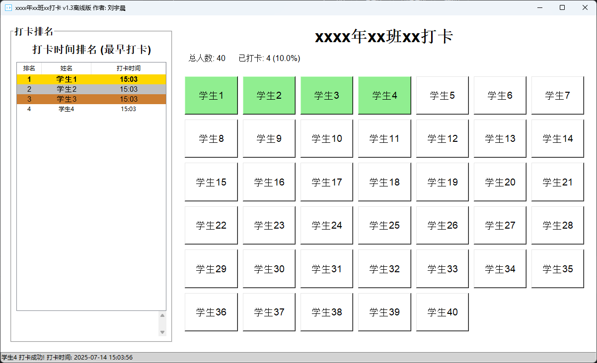

# 适用于Windows的多人打卡程序 V1.3离线版


<!-- PROJECT SHIELDS -->

[![Contributors][contributors-shield]][contributors-url]
[![Forks][forks-shield]][forks-url]
[![Stargazers][stars-shield]][stars-url]
[![Issues][issues-shield]][issues-url]
[![MIT License][license-shield]][license-url]
[![LinkedIn][linkedin-shield]][linkedin-url]

<!-- PROJECT LOGO -->
<br />

<p align="center">
  <a href="https://github.com/liuyuchen012/Internet-file-transfer">
    
  </a>

  <h3 align="center">"多人打卡系统"</h3>
  <p align="center">
    "使你更好都管理学生"
    <br />
    <a href="https://github.com/liuyuchen012/Internet-file-transfer"><strong>探索本项目的文档 »</strong></a>
    <br />
    <br />
    <a href="https://github.com/liuyuchen012/daikai/">查看Demo</a>
    ·
    <a href="https://github.com/liuyuchen012/daikai/issues">报告Bug</a>
    ·
    <a href="https://github.com/liuyuchen012/daikai/issues">提出新特性</a>
  </p>

</p>

### 应用图片



### 作者

刘宇晨 -liuyuchen012- [GitHub](https://github.com/liuyuchen012)

一名生活在天津的初中生

### 项目介绍
本人在班级担任电子教学管理员的职位，受数学老师使用Deepseek制作的打卡程序启发，制作了本程序。

### 程序介绍
此版本为此项目上传的第一个离线版本，给班级大屏无法联网的班级使用。

你可以使用config.ini配置文件配置你的班级信息。

该配置文件包含如下信息:
```
  [config]
  class_id =      //班级
  nj=             //年级
  z=7             //排版横行
  l=7             //排版竖行
  km=             //科目
  school=         //学校
```

## 如何添加学生信息？
在name.txt中添加学生信息，格式如下：
```txt
1
2
3
```

<!-- links -->
[your-project-path]:liuyuchen012/daikai
[contributors-shield]: https://img.shields.io/github/contributors/shaojintian/Best_README_template.svg?style=flat-square
[contributors-url]: https://github.com/shaojintian/Best_README_template/graphs/contributors
[forks-shield]: https://img.shields.io/github/forks/shaojintian/Best_README_template.svg?style=flat-square
[forks-url]: https://github.com/shaojintian/Best_README_template/network/members
[stars-shield]: https://img.shields.io/github/stars/shaojintian/Best_README_template.svg?style=flat-square
[stars-url]: https://github.com/shaojintian/Best_README_template/stargazers
[issues-shield]: https://img.shields.io/github/issues/shaojintian/Best_README_template.svg?style=flat-square
[issues-url]: https://img.shields.io/github/issues/shaojintian/Best_README_template.svg
[license-shield]: https://img.shields.io/github/license/shaojintian/Best_README_template.svg?style=flat-square
[license-url]: https://github.com/shaojintian/Best_README_template/blob/master/LICENSE.txt
[linkedin-shield]: https://img.shields.io/badge/-LinkedIn-black.svg?style=flat-square&logo=linkedin&colorB=555
[linkedin-url]: https://linkedin.com/in/shaojintian
