# AgoraIn 集控打卡平台 · 使用手册（v3.2.5）

> **软件全称**：AgoraIn 集控打卡平台（AgoraIn Check-in Control Platform）
> **软件版本**：服务端 v3.2.5 / 桌面客户端 v2.8.34 / 移动端 v2.8.34 / ClassIsland 插件 v2.5.0.0
> **版权人**：刘宇晨（GitHub: `liuyuchen012`）
> **文档版本**：v1.0 · 编制日期：2026 年 9 月 6 日
> **编制依据**：本手册所有界面截图均取自 AgoraIn v3.2.5 正式版实际运行环境（服务器 `192.168.31.3:5250`，ClassIsland 插件运行于 Windows 11 桌面端，移动端运行于小米平板 Pad 8 Pro、Android 17），可作为软件著作权登记、版权归属证明、验收与培训的**佐证材料**。

---

## 目录

1. [产品概述](#1-产品概述)
2. [系统架构与组件](#2-系统架构与组件)
3. [版本信息与构建记录](#3-版本信息与构建记录)
4. [部署与安装](#4-部署与安装)
5. [服务端 Web 管理面板使用详解](#5-服务端-web-管理面板使用详解)
6. [AgoraInPro 桌面客户端使用详解](#6-agorainpro-桌面客户端使用详解)
7. [ClassIsland 插件使用详解](#7-classisland-插件使用详解)
8. [移动端 App（AgoraIn Mobile）使用详解](#8-移动端-appagorain-mobile使用详解)
9. [多端联动场景演示](#9-多端联动场景演示)
10. [技术规格与环境](#10-技术规格与环境)
11. [安全与合规](#11-安全与合规)
12. [常见问题（FAQ）](#12-常见问题faq)
13. [版权声明与证明文件](#13-版权声明与证明文件)

---

## 1. 产品概述

AgoraIn 是一套面向学校/机构的**集控签到打卡与呼叫通知平台**，由四个协同组件组成：

| 组件 | 形态 | 主要职责 |
| --- | --- | --- |
| AgoraIn Server | ASP.NET Core 服务（Windows / Linux） | 设备注册与状态管理、任务下发、呼叫中心、日志审计、Web 管理面板、移动端 API |
| AgoraInPro（桌面客户端） | Windows WPF 应用 | 课堂签到打点、任务管理、打卡排名、控制模式（设备列表 / 呼叫 / 课表调度） |
| AgoraIn.ClassIslandPlugin | ClassIsland 2.x 插件 | 接收服务器/客户端/移动端呼叫，按课表状态呼出，顶部提示栏展示（15 秒倒计时自动关闭），中文语音朗读 |
| AgoraIn Mobile | .NET MAUI 移动端（Android / iOS / macOS） | 登录、仪表盘、签到任务、生成签到码、设备控制、呼叫发起、个人中心 |

**核心能力一览**

- 课堂签到打点（学生名单矩阵、打卡排名、最早打卡、签到进度与已签到名单、CSV 批次导入）；
- 集控设备管理（设备自动注册、在线状态、远程呼叫、设备重命名、配置下发）；
- 三类呼叫：**待下课时段通知 / 上课应急通知 / 下课传唤**，可指定提前提醒分钟、重复遍数、目标设备（单台 / 全部 / 仅在线）；
- 插件的课表感知呼出（依据 ClassIsland 课表状态：上课时段暂缓，临近下课或下课段立即呼出）；
- 多端联动：Web 面板、移动端、桌面客户端、ClassIsland 插件四端均可发起/接收呼叫；
- 运维安全：管理员账户体系、Web 面板协议密码修改、操作日志审计、数据库（SQLite）自动迁移。

---

## 2. 系统架构与组件

### 2.1 部署结构（本文档所依据的实际环境）

```
                 ┌──────────────────────────────────────────────┐
                 │   AgoraIn Server（Ubuntu 24.04，内网 192.168.31.3:5250）
                 │   systemd 服务：checkin.service                 │
                 │   SQLite 数据库 + ASP.NET Core Minimal API      │
                 │   Web 管理面板（/、/users、/calls、/logs、/profile）
                 └───────────┬──────────────────────────────────┘
                             │  HTTP/HTTPS（frpc 隧道：agorain.615mc.cn）
        ┌────────────────────┼───────────────────────┐
        │                    │                       │
   ┌────┴─────┐        ┌─────┴─────┐           ┌─────┴─────┐
   │ Windows  │        │  Windows  │           │ 小米平板  │
   │ AgoraInPro│       │ClassIsland│           │ Pad 8 Pro │
   │ 桌面客户端│       │ + 插件     │           │ Mobile App│
   └──────────┘        └───────────┘           └───────────┘
```

### 2.2 组件版本矩阵

| 组件 | 版本 | 技术栈 | 平台 |
| --- | --- | --- | --- |
| CheckIn.Server | v3.2.5 | .NET 10 / ASP.NET Core Minimal API / EF Core / SQLite | Windows x64、Linux x64、macOS x64/arm64 |
| AgoraInPro 桌面客户端 | v2.8.34 | .NET 10 / WPF | Windows 10/11 x64（含 Inno Setup 安装包） |
| AgoraIn.ClassIslandPlugin | v2.5.0.0 | .NET 8 / Avalonia + WinForms（提示栏） | ClassIsland 2.x（Windows） |
| AgoraIn Mobile | v2.8.34 | .NET MAUI | Android（≥ 7.0）、iOS、macOS（Catalyst） |

---

## 3. 版本信息与构建记录

### 3.1 正式发布版本（GitHub Releases）

全部正式构建产物发布在 GitHub Release **[v3.2.5](https://github.com/liuyuchen012/AgoraIn/releases/tag/v3.2.5)**，包含：

| 资产 | 描述 | 大小 |
| --- | --- | --- |
| `AgoraIn-Setup-v3.2.5.exe` | Windows 桌面客户端安装包（Inno Setup） | ≈ 47 MB |
| `AgoraIn-Server-Setup-v3.2.5.exe` | Windows 服务器安装包（Inno Setup） | ≈ 37 MB |
| `Server.win-x64.zip` | Windows 服务器自包含单文件 | ≈ 49 MB |
| `Server.linux-x64.zip` | Linux 服务器自包含单文件 | ≈ 49 MB |
| `Server.osx-x64.zip` / `Server.osx-arm64.zip` | macOS 服务器 | ≈ 49 / 47 MB |
| `Client.win-x64.zip` | Windows 客户端便携包 | ≈ 66 MB |
| `Mobile.Android.zip` | 移动端 Android 安装包（APK / AAB） | ≈ 61 MB |
| `Mobile.iOS-unsigned.zip` / `Mobile.macOS.zip` | iOS / macOS 移动端 | ≈ 70 / 23 MB |
| `ClassIsland.Plugin.cipx` | ClassIsland 插件包（cipx，v2.5.0） | ≈ 7 MB |

### 3.2 本文档截图对应的运行版本

| 界面 | 版本标识（截图中可见） |
| --- | --- |
| 服务端 Web 面板左下角 | **AgoraIn v3.2.5** |
| 桌面客户端窗口标题栏 | **AgoraIn - 默认任务 - 数学 v2.8.34 作者: 刘宇晨** |
| 移动端“我的”页 | 显示管理员账户信息及任务统计数据 |
| 服务器设备详情 | 客户端 `ClassIslandPlugin-2.4.0`（登记版本字段） |

> 说明：移动端与桌面客户端沿用独立的产品版本号（v2.8.34），服务端与插件的版本号分别为 v3.2.5 / v2.5.0.0；三者配套发布，整体称为 **AgoraIn v3.2.5 版本系**。

---

## 4. 部署与安装

### 4.1 部署服务器（Linux，推荐）

1. 将 `Server.linux-x64.zip` 上传至服务器目录（如 `/www/wwwroot/agorain`）并解压；
2. 创建 systemd 服务：

```ini
[Unit]
Description=CheckIn.Server (AgoraIn)
After=network.target

[Service]
WorkingDirectory=/www/wwwroot/agorain
ExecStart=/www/wwwroot/agorain/CheckIn.Server --urls http://0.0.0.0:5250
Restart=always

[Install]
WantedBy=multi-user.target
```

3. 启动并设为开机自启：

```bash
sudo systemctl enable --now checkin.service
```

4. 访问 `http://<服务器IP>:5250`，使用管理员账号登录（初始管理员密码请通过 `/profile` 页面及时修改）。

### 4.2 服务器健康检查

- 日志：`journalctl -u checkin.service -f`；
- 数据库：`/www/wwwroot/agorain/agorain.db`（SQLite，自动建表与迁移）；
- 常用命令行验证：

```bash
curl -s http://127.0.0.1:5250/api/client_update | head -c 200
```

### 4.3 安装桌面客户端（Windows）

运行 `AgoraIn-Setup-v3.2.5.exe` 安装向导，安装完成后从「开始菜单」启动 AgoraIn。首次使用请在「远程 → 远程服务器设置」中填写以下内容：

| 字段 | 示例 |
| --- | --- |
| 服务器地址 | `192.168.31.3`（或公网域名 `agorain.615mc.cn`） |
| 服务器端口 | `5250` |
| 服务器协议密码 | 与服务器 `config.json` 的 `ServerPassword` 一致（默认 `admin123`） |

### 4.4 安装 ClassIsland 插件

1. 将 `ClassIsland.Plugin.cipx` 复制到 ClassIsland 的插件目录（`C:\Program Files\ClassIsland\data\Plugins\agorain.classisland\`）或通过 ClassIsland 插件安装窗口导入；
2. 重启 ClassIsland（右上角或托盘菜单重启）；
3. 在 ClassIsland 设置 → 插件 → AgoraIn 联动插件中填写服务器地址与协议密码（插件支持自动探测本机 AgoraIn 客户端配置，也可手动填写）；
4. 插件会**自动向服务器登记**为呼叫接收端，登记成功后可在服务器「设备总览」看到名为 `ClassIsland-<电脑名>` 的设备，并显示「🔔 呼叫输出端」标记。

### 4.5 安装移动端（Android）

1. 手机/平板开启「USB 调试」（或直接安装 APK）；
2. 安装 `Mobile.Android.zip` 中的 APK（包名 `com.agorain.checkin`）：
   `adb install com.agorain.checkin-Signed.apk`
3. 打开 App，填写服务器地址 `http://192.168.31.3:5250`（或 `https://agorain.615mc.cn`）、用户名与密码，点击「登录」。

> 下图（平板实际运行画面）：登录页。

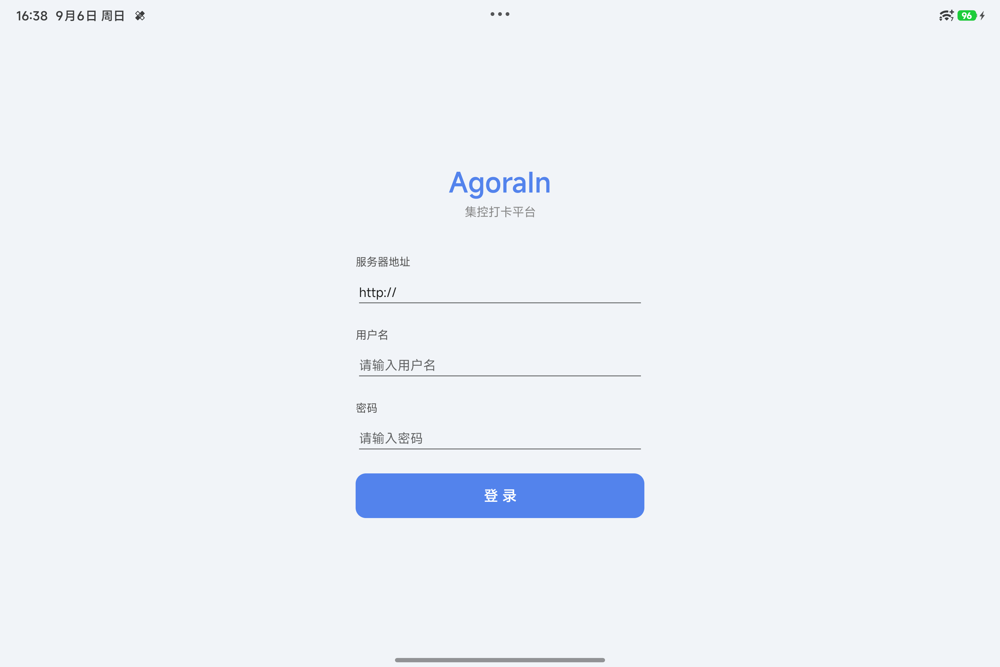

---

## 5. 服务端 Web 管理面板使用详解

登录 `http://<服务器>:5250` 后进入管理面板。左侧导航：**设备总览 / 用户管理 / 发送呼叫 / 系统日志 / 个人设置**；左下角固定显示版本号 **AgoraIn v3.2.5**。

### 5.1 设备总览（/）

- 顶部统计：设备总数、在线设备、离线设备；
- 已注册设备表：设备名称、状态（在线/离线）、任务数、最近在线、操作（查看 / 删除）；
- 直连插件（无公钥设备）会显示绿色「🔔 呼叫输出端」标记，表示该设备作为呼叫播报端使用。

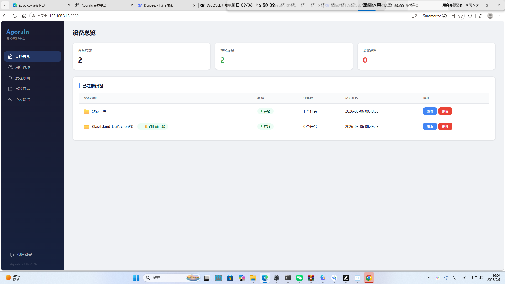

### 5.2 发送呼叫（/calls）

支持三种呼叫类型并可指定目标设备：

| 呼叫类型 | 场景 | 效果 |
| --- | --- | --- |
| 待下课时段通知 | 提醒学生即将下课 | 按课表状态在下课时段前 N 分钟呼出 |
| 上课应急通知 | 紧急/突发事件 | 立即播报（不受课表限制） |
| 下课传唤 | 下课后叫学生到办公室 | 按课表状态在下课时段呼出 |

可配置项：标题、内容、提前提醒（分钟，0 = 到下课时间提醒）、本次呼叫重复遍数（1~N 遍，第 1 遍语音朗读，其余为动画节奏）、发送范围（全部设备 / 仅在线设备）、发送目标（一键发送到指定设备）。

页面下方「最近发送记录」展示：ID、类型、标题、目标设备、发送者、时间、状态（已确认等）与操作（重发一遍 / 删除）。

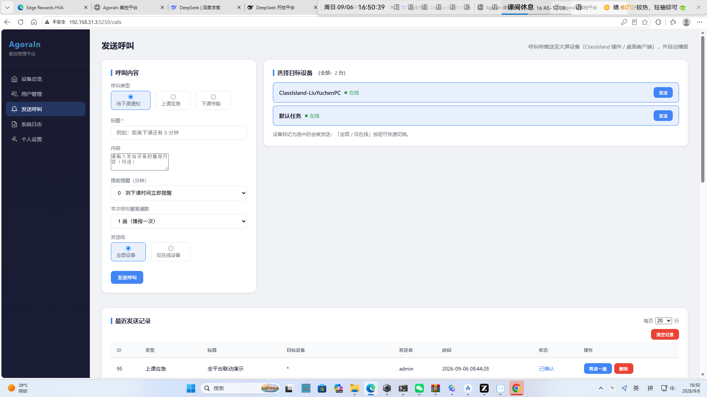

### 5.3 系统日志（/logs）

记录服务器关键操作：`login`（用户登录）、`send_call`（发送呼叫）、`repeat_call`（重发呼叫）等，包含 ID、级别、类型、操作者、内容摘要、时间戳，支持级别筛选、分页、单条删除与清空日志。

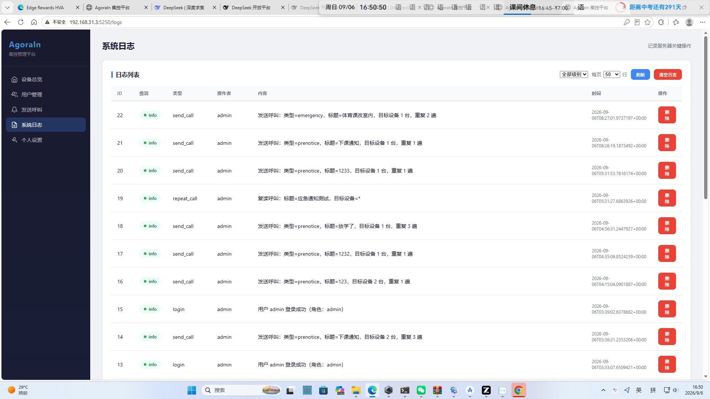

### 5.4 用户管理（/users）

新增/编辑/启用/停用平台用户，字段：用户名、显示名称、角色（管理员）、状态、创建时间。

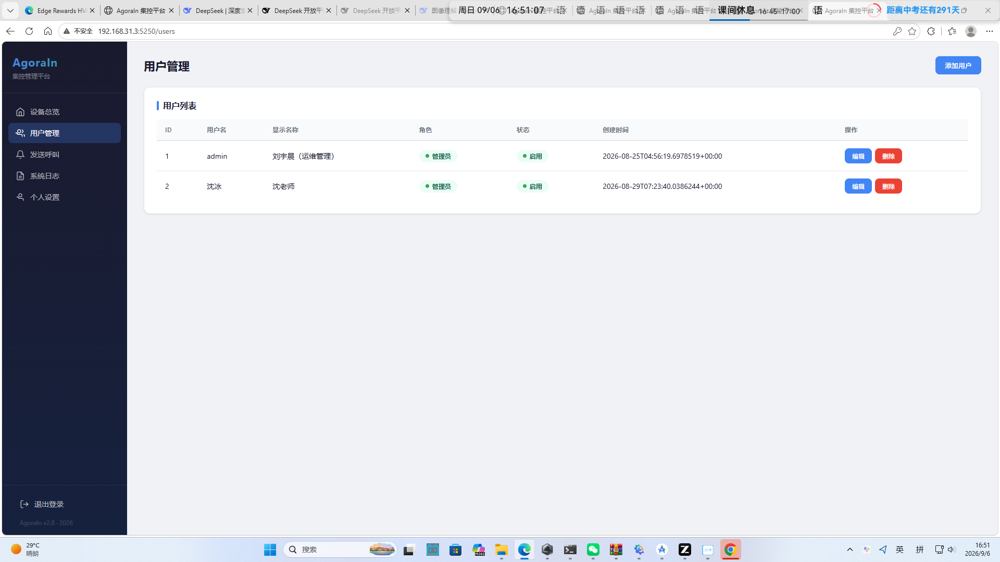

### 5.5 个人设置（/profile）

- **账户信息**：用户名、显示名称、角色、创建时间（可用于核对账户创建记录）；
- **修改密码**：需填写旧密码（管理员账户体系）；
- **设备协议密码**：客户端/插件连接密码（`config.json` 的 `ServerPassword`，默认 `admin123`）。**修改后请同步更新客户端「远程服务器设置」与插件设置中的密码**；新密码至少 8 位。

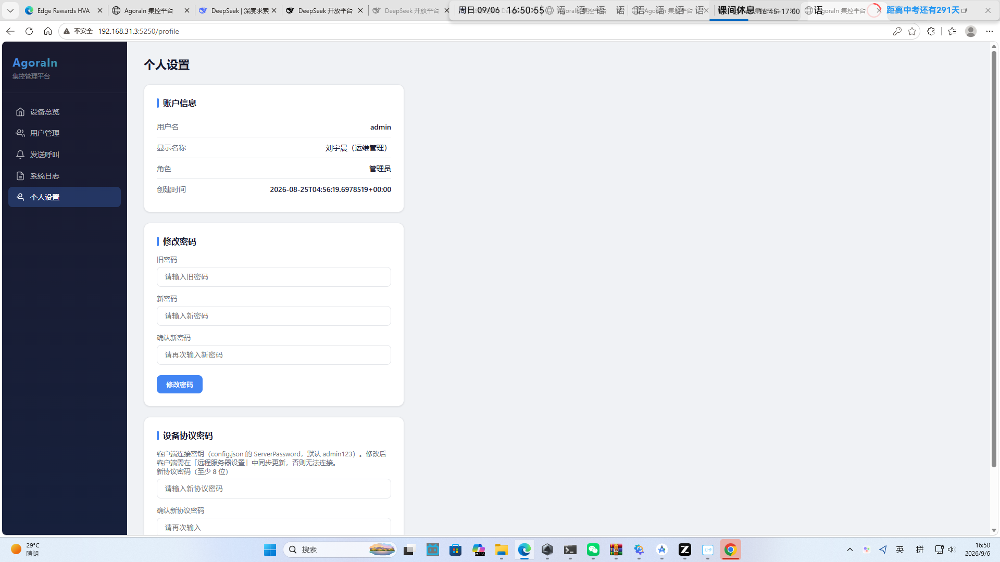

### 5.6 设备详情（/machine/{uuid}）

展示设备名称、在线状态、客户端版本（如 `ClassIslandPlugin-2.4.0`）、「呼叫输出端」标记、任务列表；支持操作：重命名、编辑配置、删除设备。

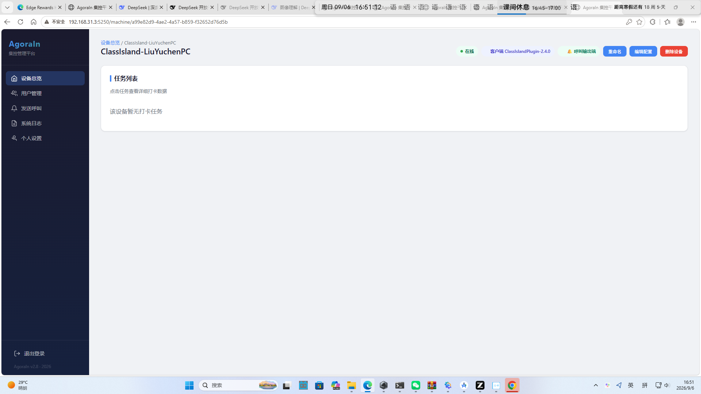

---

## 6. AgoraInPro 桌面客户端使用详解

### 6.1 主窗口（大课堂模式）

左侧为任务树（我的任务 → 任务列表），中间为打卡排名（最早打卡、打卡时间），右侧为学生打卡矩阵（已打卡学生高亮，右键已打卡学生可取消打卡），底部状态栏显示「服务器: 在线」。顶部菜单：文件 / 远程 / 设置 / 帮助，以及**大课堂模式 ↔ 控制模式**切换。

### 6.2 控制模式（控制中心）

通过顶部下拉切换到「控制模式」打开控制中心：

- **左侧导航**：设备列表 / 任务中心 / 集控平台列表；顶部显示总设备数、总任务数、在线设备数；
- **课时划消与排课**：按日历选择日期，进行「划消课时 / 增加课时 / 忘记课、请假调课」管理；可为学生设置上课/下课时间，进行「提醒排课」；已排课学生可修改/取消提醒；
- **设备列表（呼叫面板）**：以表格展示 选中 / 集控平台 / 设备名称 / 状态 / UUID / 操作（呼叫）等列；工具栏提供「刷新设备 / 全选 / 发送到所选」。设备列表为空时提示：*「请确认设备端已开机并在『远程 → 远程服务器设置』中指向同一台服务器」*。

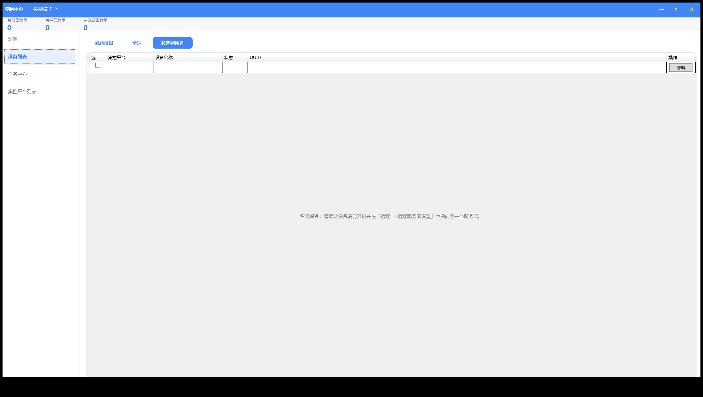

> 说明：客户端通过「远程服务器设置」连接集控平台后，设备列表会显示平台上的所有设备，选中设备即可实现「发送到所选」（远程呼叫/任务下发）。

### 6.3 远程菜单

- **远程服务器设置**：配置服务器地址（如 `192.168.31.3`）、端口（默认 `5250`）与服务器协议密码（默认 `admin123`）；保存后底部平台连接状态更新为正常；
- **创建签到**：新建签到任务（签到密码、确认密码、教室、科目、学生名单导入 CSV）；
- **检查服务器状态**：检测与平台连接/版本一致性；
- **从服务器加载数据 / 同步数据到服务器**：任务与打卡数据的双向同步。

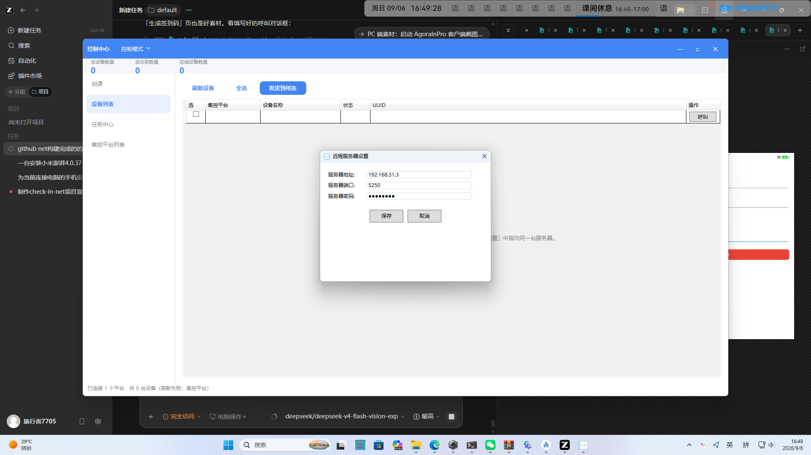

### 6.4 任务与打卡

- 创建签到任务后，学生打卡（大屏模式可放置到教室大屏或平板，学生点击自己的名字打点）；
- 打卡排名实时刷新，标注最早打卡与打卡时间；
- 支持 CSV 名单导入（可用打卡功能导出的 CSV 作为学生名单）。

---

## 7. ClassIsland 插件使用详解

### 7.1 插件信息

| 项目 | 值 |
| --- | --- |
| 插件 ID | `agorain.classisland` |
| 名称 | AgoraIn 联动插件 |
| 版本 | 2.5.0.0 |
| 宿主 | ClassIsland 2.x（.NET 8，Windows） |
| 包格式 | `.cipx`（ClassIsland 标准插件包） |

### 7.2 配置项（插件设置页）

- 服务器地址（支持自动探测本机 AgoraIn 客户端配置）；
- 服务器协议密码；
- 设备 UUID（首次自动登记，无需填写）；
- 待下课提醒开关（开启后：待下课时段通知与下课传唤按课表状态呼出）；
- 轮询间隔（秒）。

### 7.3 呼出策略（课表感知）

- **上课应急通知**：不受课表限制，立即呼出；
- **待下课时段通知 / 下课传唤**：依据 ClassIsland 课表状态——
  - 上课时段且距下课剩余时间 ＞ 提前提醒分钟数：**暂缓**（不打扰课堂）；
  - 距下课剩余时间 ≤ 提前提醒分钟数 或 已进入课间休息/下课段：**立即呼出**；
  - 无课表（放假/未加载）：按下课状态立即呼出；
  - 课表状态获取失败：保守暂缓，待下一轮轮询再试。

### 7.4 呼出展示（顶部提示栏）

收到呼叫后，插件在屏幕顶部展示**单行提示栏**（类型色：应急=红、传唤=橙、待下课=蓝），内容为「类型 · 标题 · 内容」，右侧倒计时「N 秒后自动关闭」，**15 秒后自动关闭**（面板为 WinForms 置顶条，位于任何界面之上，保证可见性与平台兼容）。

同时进行**中文语音朗读一遍**（第 1 遍有声；其余重复遍数仅保留节奏，不再重复发声）。

### 7.5 与服务器的联动标识

插件无需桌面客户端即可独立运行：插件启动后自动向服务器登记，服务器设备列表显示 `ClassIsland-<电脑名>`，标记「🔔 呼叫输出端」，并持续心跳（轮询）上报在线状态。

---

## 8. 移动端 App（AgoraIn Mobile）使用详解

### 8.1 登录

填写服务器地址（支持 `http://` 局域网与 `https://` 公网域名）、用户名与密码，点击「登录」。登录后数据与服务器实时同步。

### 8.2 仪表盘

- 统计卡片：总设备、在线设备、用户总数、今日签到；
- 快捷按钮：**任务管理 / 生成二维码 / 用户管理**；
- 活跃签到任务（任务名 + 进度 2/40 等）；
- 设备列表（设备名 + 任务数）。

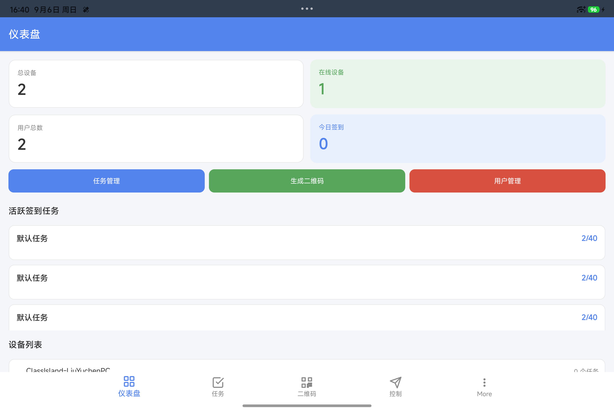

### 8.3 任务（签到任务列表）

展示任务列表：任务名称、状态（进行中）、签到进度（如 3/40）、创建时间；点击任务可进入详情查看已签到学生与时间。

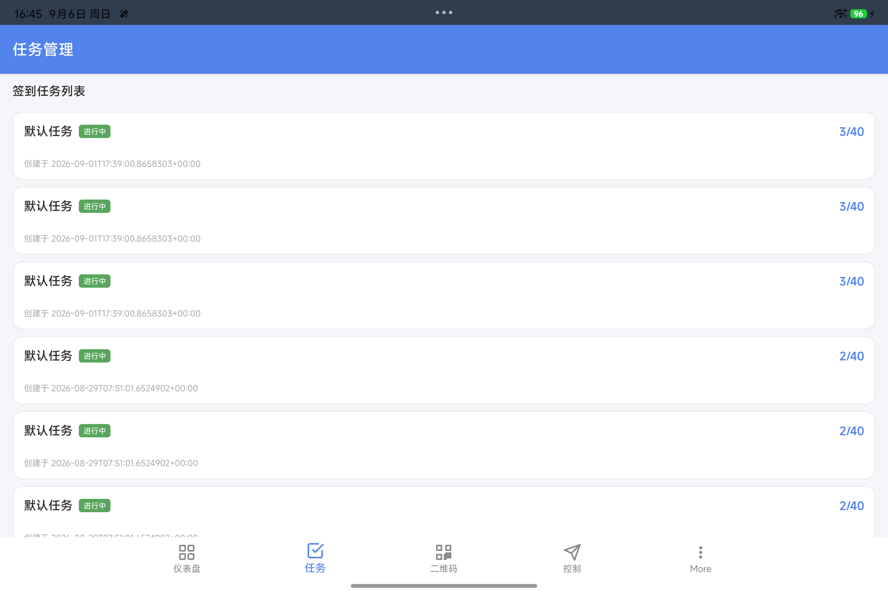

### 8.4 二维码（生成签到码）

创建签到任务：选择设备、科目、教室、签到密码、学生名单（每行一个姓名），生成后学生可扫码签到。

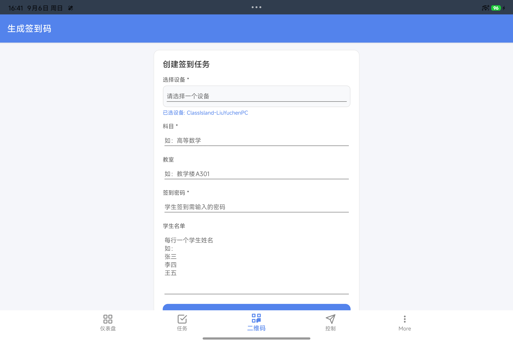

### 8.5 控制（呼叫面板）

- 设备列表：勾选目标设备（在线/离线状态、圆点指示灯）；
- 工具栏：刷新 / 全选 / 发送到所选；
- 点击「发送到所选」弹出呼叫对话框：呼叫类型（待下课时段通知 / 上课应急通知 / 下课传唤）、提前 N 分钟、标题、内容，确认后点「发送呼叫」。

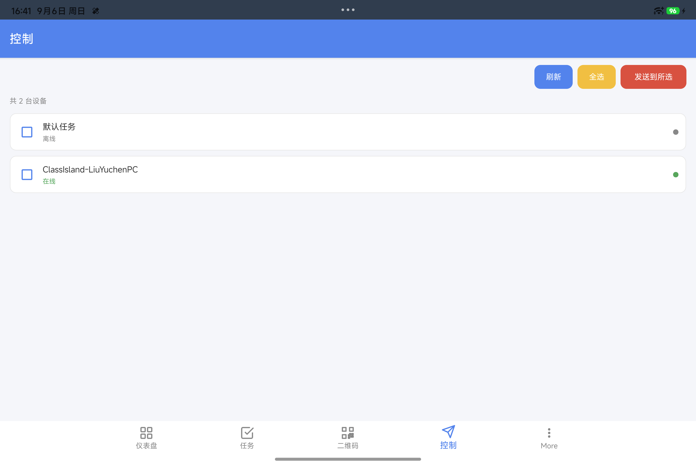
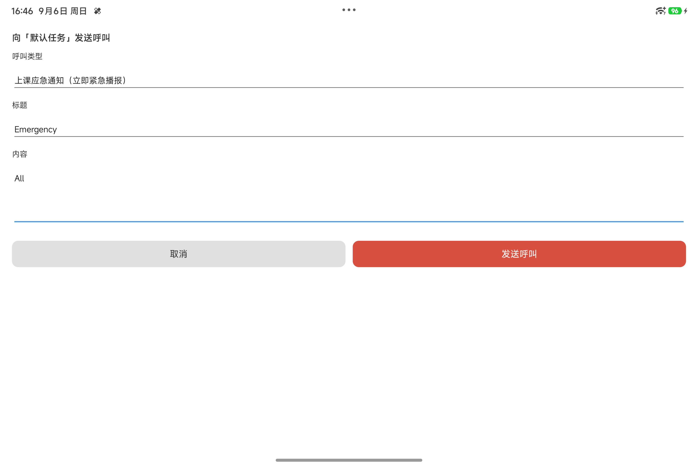

### 8.6 More（用户与我的）

- **用户**：查看平台用户列表；
- **我的**：账户信息（显示名称「刘宇晨（运维管理）」、角色「管理员」）、总签到次数（如 77）、任务数（如 37）、任务签到进度与已签到名单。

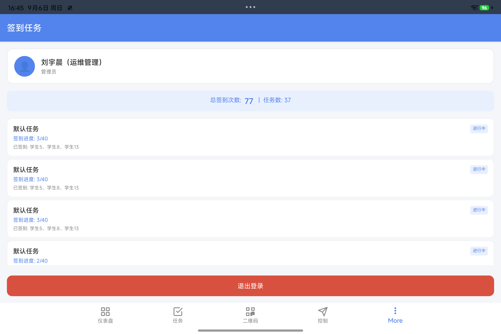

---

## 9. 多端联动场景演示

### 9.1 场景一：Web 服务器发起应急呼叫

1. 管理员登录 Web 面板「发送呼叫」→ 选择「上课应急通知」，填写标题与内容，选择「全部设备 / 仅在线设备」，点击发送；
2. 服务器记录一次 `send_call` 日志、设备状态标记「已确认」；
3. ClassIsland 插件（全平台任一在线插件）立即弹出顶部提示栏并语音播报。

### 9.2 场景二：移动端发起、电脑端响铃（实测记录）

1. 小米平板 App →「控制」→ 勾选 `ClassIsland-LiuYuchenPC` →「发送到所选」→ 类型「上课应急通知」→ 标题 `EmergencyDrill` → 发送；
2. Windows 桌面 ClassIsland 插件在 **1 秒内**收到服务器推送并弹出顶部红色提示栏：
   - 内容：`上课应急通知 · 全平台联动演示 · 移动端发起，电脑端提示栏 15 秒倒计时自动关闭。`
   - 右侧倒计时（截图中显示「9 秒后自动关闭」）；
3. 插件自动向服务器 ack，呼叫记录状态变为「已确认」。

> 下图：移动端发起呼叫的同时，Windows 桌面顶部提示栏实际运行画面（联动实测）。

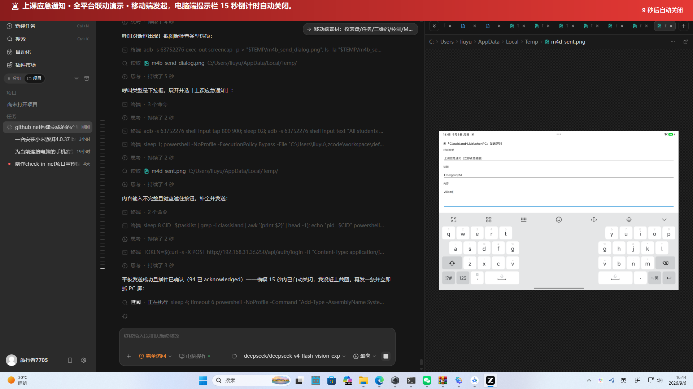

### 9.3 场景三：下课传唤（课表感知）

1. 管理员在「发送呼叫」页选择「下课传唤」，目标 `ClassIsland-LiuYuchenPC`；
2. 若当前上课且距下课较远 → 插件**暂缓**；进入课间休息/临近下课 → 立即在顶部提示栏呼出（橙色，传唤主题）。

---

## 10. 技术规格与环境

| 项目 | 规格 |
| --- | --- |
| 服务端 | .NET 10 · ASP.NET Core Minimal API · EF Core · SQLite · 自包含 SingleFile 发布 |
| 桌面客户端 | .NET 10 · WPF · DPAPI 配置加密 · 自动更新（/api/client_update）· Win10/11 DPI 感知（PerMonitorV2） |
| 移动端 | .NET MAUI（Android / iOS / macOS Catalyst） |
| 插件 | .NET 8（win-x64）· Avalonia + WinForms · System.Speech 中文 TTS · ClassIsland SDK 2.0.0.2 |
| 默认端口 | 5250（HTTP）；公网：`https://agorain.615mc.cn`（frpc 隧道 → 内网 5250） |
| 设备协议 | 设备注册（UUID + 公钥/自登记）、呼叫拉取（`/api/calls_pull` 心跳）、呼叫确认（`/api/calls_ack`） |
| 认证 | Web 面板：管理员会话；移动端：Bearer Token（HMAC）；设备端：协议密码 |
| 数据库 | SQLite（`agorain.db`），服务启动自动建表与幂等迁移（增加列，不影响既有数据） |
| 日志 | 服务器：系统日志（send_call / repeat_call / login）；Windows 客户端：`%LOCALAPPDATA%\AgorAIn\logs`；插件：`%LOCALAPPDATA%\AgoraIn\plugin.log` |

---

## 11. 安全与合规

1. **初始口令**：默认协议密码 `admin123`，**建议首次部署后立即修改**（Web 面板「个人设置 → 设备协议密码」，至少 8 位）；修改后同步更新客户端与插件连接密码；
2. **管理员口令**：通过「个人设置 → 修改密码」独立管理；
3. **审计**：系统日志记录所有登录与呼叫操作（操作者、时间、目标），可审计追责；
4. **传输**：公网访问通过 HTTPS（frpc 隧道）；内网可走 HTTP；
5. **最小权限**：设备端仅使用协议密码 + UUID 进行呼叫拉取，无法访问管理接口；
6. **口令存储**：客户端配置（含服务器密码）经 Windows DPAPI 加密存储在本机。

---

## 12. 常见问题（FAQ）

**Q1：客户端「设备列表」提示“暂无设备（刷新失败：集控平台）”？**
A：请确认「远程 → 远程服务器设置」中地址/端口/协议密码与服务器一致，且服务器已启动；修改后点击「刷新设备」。

**Q2：插件收不到呼叫？**
A：① 检查插件设置中服务器地址与密码；② 确认服务器「设备总览」中存在 `ClassIsland-<电脑名>` 设备且状态为「在线」；③ 若设备列表不存在，重启 ClassIsland 使其自动登记；④ 核对轮询间隔（默认 10 秒）。

**Q3：待下课时段通知上课时就弹出了？**
A：插件按课表状态呼出；如仍异常请确认 ClassIsland 已加载课表且主计时器运行（插件状态可通过 `%LOCALAPPDATA%\AgoraIn\poller.log` 查看课表状态日志）。

**Q4：修改协议密码后客户端连不上服务器？**
A：协议密码修改后，客户端「远程服务器设置」与插件设置中的密码需同步更新；忘记时可在服务器 `config.json` 中重置 `ServerPassword` 并重启服务。

**Q5：移动端无法登录？**
A：① 确认服务器地址可访问（局域网用 `http://192.168.31.3:5250`）；② 使用管理员/教师账号密码；③ 若为公网访问请使用 `https://agorain.615mc.cn`。

**Q6：Windows 10 上客户端点开无反应？**
A：v3.2.5 已内置 Win10 兼容加固（DPI 感知、异常保护与日志），如仍失败请提交 `%LOCALAPPDATA%\AgoraIn\logs` 中的日志。

---

## 13. 版权声明与证明文件

### 13.1 版权与权利归属

- **软件名称**：AgoraIn 集控打卡平台（含 AgoraIn Server、AgoraInPro 桌面客户端、AgoraIn.ClassIslandPlugin、AgoraIn Mobile 四组件）；
- **作者/版权人**：刘宇晨；
- **开源托管**：GitHub `liuyuchen012/AgoraIn`（分支 `v3.2`，构建产物发布于 Release `v3.2.5`）；
- **授权**：版权所有。未经授权不得复制、分发或用于商业用途的二次发布；引用须注明来源。

### 13.2 版本唯一标识

| 组件 | 版本标识 | 发布时间 | 佐证 |
| --- | --- | --- | --- |
| Server | v3.2.5 | 2026-09-06 | Web 面板左下角“AgoraIn v3.2.5”；GitHub Release v3.2.5 |
| Client | v2.8.34 | 2026-09-06 | 窗口标题“AgoraIn - 默认任务 - 数学 v2.8.34 作者: 刘宇晨” |
| Plugin | v2.5.0.0 | 2026-09-06 | `manifest.yml`：version: 2.5.0.0；cipx 校验值见 Release |
| Mobile | v2.8.34 | 2026-09-06 | 安装包版本号 2.8.34（csproj ApplicationDisplayVersion） |

### 13.3 实机运行佐证（截图索引）

以下截图均为本手册编制时在真实运行环境中采集，用于证明软件功能与版本状态：

| 截图 | 文件 | 采集设备 |
| --- | --- | --- |
| 服务端设备总览（v3.2.5 + 呼叫输出端标记） | `images/server-overview.png` | Windows 浏览器访问 192.168.31.3:5250 |
| 服务端发送呼叫、系统日志、用户管理、个人设置、设备详情 | `images/server-calls.png`、`server-logs.png`、`server-users.png`、`server-profile.png`、`server-machine.png` | 同上 |
| 客户端控制中心设备列表 | `images/client-control-center.png` | Windows 11 桌面端（PrintWindow 实拍） |
| 客户端远程服务器设置 | `images/client-remote-settings.png` | Windows 11 桌面端 |
| 插件顶部提示栏联动（PC） | `images/linkage-full.png` | Windows 11 桌面端（移动端发起呼叫时实拍） |
| 移动端登录/仪表盘/任务/签到码/控制/呼叫/我的 | `images/mobile-*.png` | 小米平板 Pad 8 Pro（Android 17，adb 实拍） |

### 13.4 维护与支持

- 文档站点：https://doc.615mc.cn
- 服务器在线演示：https://agorain.615mc.cn
- 源码与 Release：https://github.com/liuyuchen012/AgoraIn

---

*本手册由 AgoraIn 项目组编制，© 2026 刘宇晨。手册内容与截图未经许可不得用于商业用途。*
